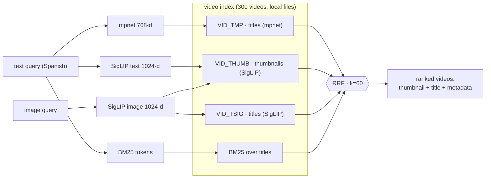
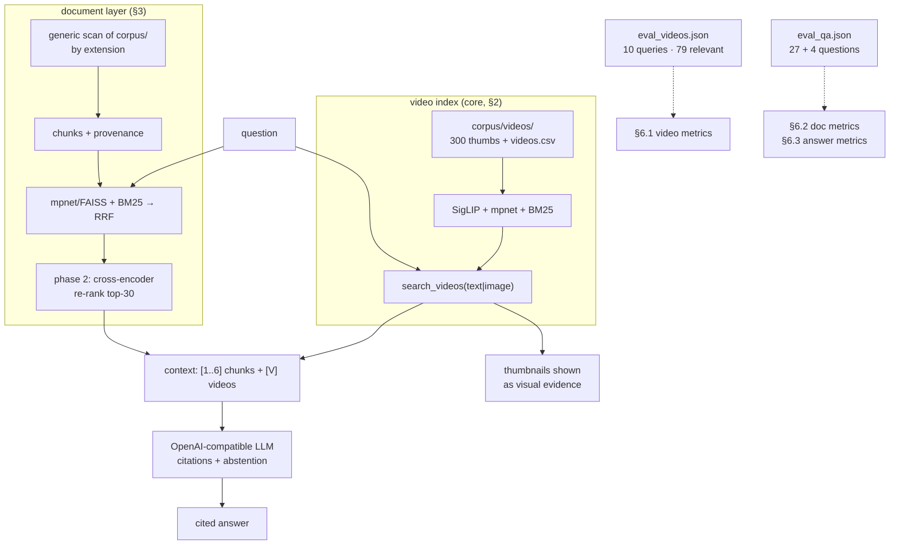

# Project 3 · Multimodal RAG assistant

> A Retrieval-Augmented Generation assistant whose corpus is **centered on video
> thumbnails and titles**, the same multimodal pair the whole MAVIS thesis studies,
> surrounded by a secondary documentation layer in 5 more file formats. Ask in natural
> language; get a cited answer plus the **actual thumbnails** of the most related
> videos as visual evidence.

The brief asks for a basic RAG over at least 5 formats plus a measured improvement.
This project ships both, with three design commitments on top:

1. **Images and titles are first-class.** A dedicated video index (SigLIP image
   embeddings, cross-modal text→image, mpnet titles, BM25, fused with RRF: Project 2's
   engine miniaturized) answers every query with real videos, queryable **by text or
   by image**, and gets its own gold set and evaluation.
2. **Whatever is in the folders gets indexed.** Ingestion walks `corpus/` generically
   by extension; there is no hardcoded file list. Drop a file in, re-run, it is part
   of the assistant.
3. **The folder is self-contained.** The 300-video corpus (320px thumbnails +
   `videos.csv`) lives inside `corpus/videos/`; embeddings are computed from those
   local files and cached locally. Nothing references a path outside
   `04-multimodal-rag/`.

## TL;DR

- **Corpus**: 300 videos (thumbnail + title + metadata, 206 channels, ~6 MB) sampled
  from the MAVIS dataset, plus 18 documents in `md`, `pdf`, `csv`, `json`, `yaml`,
  `txt` (the video metadata CSV is indexed on both sides).
- **Video search** (the core): text and/or image queries against thumbnails and titles
  through three fused paths (semantic titles, cross-modal text→thumbnail, lexical).
- **Doc layer**: generic per-extension ingestion → ~1800-char chunks with provenance
  headers → mpnet in a FAISS exact index + BM25 → RRF.
- **Generation**: OpenAI-compatible LLM, text-only by design; context = doc chunks +
  a block of related video titles; thumbnails displayed as evidence; inline `[n]`/`[V]`
  citations; explicit abstention.
- **Phase 2**: cross-encoder re-ranking of doc candidates, measured against phase 1.
- **Evaluation first**: three layers (video retrieval, doc retrieval, answer quality),
  two hand-annotated gold sets + one label-free check, 11 metrics in total.

## 1 · The corpus (which documents and formats?)

| part | files | content |
|---|---|---|
| **`corpus/videos/`** (core) | 300 `.jpg` + `videos.csv` | thumbnails at 320px (SigLIP sees 256px, so this is lossless for the model) with title, channel, views, date, url per video; random sample (seed 42) of the 42k-video MAVIS dataset |
| `corpus/md/` | 7 | the five project READMEs, the explainability write-up, the papers synthesis |
| `corpus/pdf/` | 5 | the TFM literature (Cui 2024, Trzciński 2017, Nisa 2021, Ou 2025, Wu 2018) |
| `corpus/csv/` | 1 | per-channel statistics of the full dataset (844 channels) |
| `corpus/json/` | 1 | Project 2's hand-annotated retrieval gold set |
| `corpus/yaml/` | 1 | the platform's `docker-compose.yml` |
| `corpus/txt/` | 2 | YouTube discovery queries + the platform's `.env.example` |

Ingestion is **generic by extension** (no file list): `md` splits by headings, `pdf`
by pages (`pypdf`), `txt` by paragraph blocks, and the structured formats are
*serialized into sentences* before indexing, also generically: every CSV row becomes a
`column: value` sentence (plus a file summary), every JSON entry one line, every YAML
flattens to dotted `key: value` lines plus the raw text. Embedding raw syntax retrieves
poorly on both the dense and the lexical axis; sentences work on both.

## 2 · The video index (the core)



Each encoder works where Project 2 measured it is strong: **SigLIP-2 large** owns every
path that touches an image (image↔image, text→image, image→title), **mpnet** owns
title↔title (SigLIP's text tower is anisotropic at text↔text), and **BM25** covers
literal tokens. A text query runs three paths, an image query two, and RRF (rank-based,
so no score calibration across encoders) fuses whatever ran. All three embedding
columns are computed **from the local files** on first run (~2 minutes) and cached in
`cache/video_index.npz`.

## 3 · The document layer (model, vector store, and why)

- **Embeddings: `paraphrase-multilingual-mpnet-base-v2`** (768-d, masked mean-pooling
  + L2), the recipe Project 2 validated. Multilinguality is load-bearing: the corpus
  is mostly English, the users and both gold sets ask in Spanish.
- **Vector store: FAISS `IndexFlatIP`**, exact inner product = cosine on normalized
  vectors. The notebook *measures* that at this scale (hundreds of chunks) the flat
  index and a plain NumPy dot product return the identical top-10 at comparable
  latency; an approximate index (IVF/HNSW) was rejected because it trades recall for
  speed this corpus does not need. Chunk embeddings are cached and keyed by a corpus
  hash.
- **Lexical layer: BM25** (Okapi, accent-stripped tokens, `k1=1.5`, `b=0.75`), one
  shared implementation for titles and chunks. It covers literal identifiers
  (`mavis_hf_cache`, `KNN_TEMPS`, `ytInitialData`) that dense retrieval structurally
  misses.
- **Fusion: RRF** (`k=60`), then **phase 2** re-ranks the top-30 candidates with a
  multilingual cross-encoder (`mmarco-mMiniLMv2-L12-H384-v1`): the step Project 2
  proposed and left pending, implemented and measured here.

## 4 · Generation: the assistant

The LLM is reached through an **OpenAI-compatible** endpoint, and generation is
**text-only by design**: the model receives the top-6 document chunks as numbered
blocks plus a block labeled `[V]` with the most related videos (title, channel, views)
from the video index; the retrieved **thumbnails are displayed to the user** as visual
evidence next to the answer. The system prompt forces four behaviors, each measured in
§6.3: context-only answers, inline `[n]`/`[V]` citations, the question's language, and
explicit abstention when the context lacks the answer.

| env var | default | meaning |
|---|---|---|
| `OPENAI_API_KEY` | required for generation | any non-empty string for local servers |
| `OPENAI_BASE_URL` | `https://api.openai.com/v1` | endpoint (Ollama: `http://localhost:11434/v1`) |
| `RAG_CHAT_MODEL` | `gpt-5-mini` | generation model |
| `RAG_JUDGE_MODEL` | = chat model | LLM-as-judge model |

Variables can live in the shell or in a local `.env` (copy [`.env.test`](.env.test);
the shell wins; `.env` is git-ignored). Everything except generation and §6.3 runs
without a key.

## 5 · The whole system



## 6 · Evaluation (the core of the project)

Three layers, because the system can fail in three different places: the video index,
the document retrieval, and the final answer. Each layer has its own gold set and its
own metrics.

### 6.1 · Video retrieval (the multimodal core)

[`eval_videos.json`](eval_videos.json): **10 Spanish queries with 79 relevant videos**
annotated by reading the 300 titles (one annotator, binary relevance, annotated before
running the system). The queries span the corpus's real topics (recipes, workouts,
business simulators, song reactions, local AI agents, movie reviews, sad songs, travel
vlogs, personal finance) and exercise the cross-lingual path: Spanish queries against
titles in English, German, Japanese, Hindi and more. A **path ablation** compares mpnet
titles alone, cross-modal alone, both, and the full hybrid (+BM25). A **label-free
check** complements it: each title (SigLIP text) retrieves among all 300 thumbnails;
the rank of its own thumbnail measures cross-modal alignment with zero labels.

**Label-free alignment** over the 300 pairs: title→own-thumbnail Recall@1 **0.203**
against 0.003 random (≈60×), MRR 0.269. The cross-modal space is genuinely aligned.

**Gold-set results** (10 queries, 79 relevant videos; deterministic given the corpus):

| config | R@5 | R@10 | MRR | nDCG@10 | P@5 | latency |
|---|---|---|---|---|---|---|
| **mpnet titles only** | **0.470** | **0.666** | **0.920** | **0.716** | **0.720** | ~49 ms |
| + cross-modal (text→thumb) | 0.424 | 0.645 | 0.783 | 0.647 | 0.600 | ~46 ms |
| cross-modal only (pixels, no title match) | 0.291 | 0.382 | 0.548 | 0.380 | 0.360 | ~26 ms |
| hybrid full (+BM25) | 0.220 | 0.394 | 0.724 | 0.407 | 0.360 | ~38 ms |

Three readings:

1. **Titles dominate topical queries.** The 10 gold queries describe topics, and
   titles describe topics too, so the mpnet path alone puts a relevant video at
   position 1 for almost every query (MRR 0.92).
2. **The image path earns its place elsewhere.** Cross-modal alone reaches MRR 0.55
   *from pixels*: no title is read, the Spanish query matches what the thumbnail
   shows. It is the only path available for image queries (thumb↔thumb, thumb→title)
   and for visual-style questions, and the measurement shows it is real signal, far
   above chance.
3. **Fusion dilutes a dominant path.** Adding paths lowered MRR on this gold set
   (0.92 → 0.78 → 0.72): RRF averages ranks, so overlapping weaker paths dilute a
   stronger one. The engine keeps per-path control (`use=`), letting the caller pick
   paths per query type; this mirrors the BM25 finding in §6.2.

### 6.2 · Document retrieval

[`eval_qa.json`](eval_qa.json): 27 answerable questions (relevant document(s) +
reference answer, annotated from the sources) plus 4 unanswerable ones. Annotation at
**document** level (stable across re-chunking); a chunk is relevant iff it belongs to
a gold document. Metrics: Recall@5/@10 (gold-doc coverage in the top-k chunks), MRR
(first relevant chunk), nDCG@10 (one gain per gold doc at first occurrence),
Precision@5 (≈ *context precision*, how clean is what the LLM receives), latency.
Configurations: dense, hybrid, hybrid+re-rank.

| config | R@5 | R@10 | MRR | nDCG@10 | P@5 | latency |
|---|---|---|---|---|---|---|
| dense (mpnet + FAISS) | 0.704 | 0.778 | 0.520 | 0.544 | 0.304 | ~39 ms |
| hybrid (+BM25), phase 1 | 0.500 | 0.741 | 0.441 | 0.487 | 0.289 | ~15 ms |
| **hybrid + re-rank, phase 2** | **0.815** | **0.889** | **0.811** | **0.786** | **0.519** | ~547 ms |

1. **Phase 2 is a large measured win**: +0.37 MRR over phase 1 and +0.29 over dense,
   with context precision nearly doubling (0.29 → 0.52). The ~0.5 s cost is small
   next to multi-second generation.
2. **BM25 hurts cross-lingually, and the gold set caught it**: Spanish question tokens
   rarely match English prose, so the lexical path promotes chunks with incidental
   Spanish tokens on conceptual queries (MRR 0.52 → 0.44) while it still wins on
   literal-identifier queries (file names, env vars, author names). The re-ranker
   repairs the ordering downstream.
3. **Latency note**: the dense/hybrid gap is encoder warm-up noise (hybrid does
   strictly more work); the meaningful contrast is tens of milliseconds (phase 1)
   against ~0.5 s (phase 2).

### 6.3 · Answer quality

Five complementary axes; no single one is trustworthy alone, together they triangulate:

| metric | type | what it catches |
|---|---|---|
| **token-F1** vs reference | deterministic | gross lexical correctness (punishes EN→ES paraphrase: read as a floor) |
| **correctness (1–5)** | LLM-judge vs reference answer | semantic correctness and completeness |
| **faithfulness (1–5)** | LLM-judge vs retrieved context | hallucination: claims unsupported by the context |
| **citation validity** | deterministic | every `[n]` points to an existing block |
| **abstention accuracy** | LLM-judge on the 4 unanswerable questions | saying "the docs don't cover this" instead of inventing |

Measured results (chat and judge: `gpt-5-mini`; the context includes the [V] video
block; per-question records cached in `cache/gen_results.json`):

| config | token-F1 | correctness (1–5) | faithfulness (1–5) | citations valid | abstention acc | latency |
|---|---|---|---|---|---|---|
| base (hybrid), phase 1 | 0.304 | 2.78 | 4.63 | 1.00 | 1.00 | 8.3 s |
| **improved (+re-rank), phase 2** | **0.388** | **4.11** | **4.93** | **1.00** | **1.00** | 9.8 s |

1. **The retrieval gain propagates end to end** (correctness 2.78 → 4.11): with
   re-ranked context the model answers questions whose evidence the base context did
   not contain; on those, the base system tends to abstain.
2. **Faithfulness alone would hide that problem**: an abstention counts as supported,
   so the base config still scores 4.63. High faithfulness with low correctness reads
   as a *retrieval* problem, which is exactly why the suite pairs both metrics.
3. **The guardrails hold**: 100% valid citations and 4/4 correct abstentions on the
   unanswerable questions, in both configurations.
4. **Honest failure case** (printed by §14): q11 asks for Project 2's exact metric
   table; even the re-ranked context misses those numbers and the system abstains on
   an answerable question (correctness 1). Abstaining beats inventing; it is the
   designed failure mode.

### 6.4 · Honest limitations

1. Both gold sets are small (10 video queries, 31 doc questions): indicative only.
2. Single annotator, mitigated by annotating from sources before running the system.
3. Judge = answer model by default (self-preference bias); set `RAG_JUDGE_MODEL` to a
   stronger, different model for less biased scores.
4. Doc-level relevance is coarse with 17 documents; chunk-level MRR/P@5/nDCG carry the
   discrimination.
5. PDFs enter as raw page text (no layout/table parsing); token-F1 is depressed by
   cross-lingual paraphrase.
6. 300 videos is a deliberately small, shippable sample of the 42k-video MAVIS corpus;
   the architecture is unchanged at full scale (Project 2 runs the same engine over
   42k).

## 7 · Running it

```bash
# 1. (optional, for generation) configure any OpenAI-compatible endpoint
cp 04-multimodal-rag/.env.test 04-multimodal-rag/.env   # then fill in OPENAI_API_KEY
# OPENAI_BASE_URL=http://localhost:11434/v1 switches to a local server, e.g. Ollama

# 2. execute the notebook
jupyter nbconvert --to notebook --execute --inplace \
  --ExecutePreprocessor.timeout=-1 \
  04-multimodal-rag/01_multiformat_rag.ipynb
```

First run encodes the 300 thumbnails and the chunks (a few minutes) and caches
everything under `cache/`. Without an API key the notebook still runs end to end
(video index, doc layer, both retrieval evaluations); generation cells skip with a
clear message. Per-question generation results are cached, so repeated runs only pay
for what is new. The folder is self-contained: it can be copied or pushed to its own
repository as-is.

## 8 · What we learned about RAG systems

1. **Multimodal needs modality-aware indexing.** One shared multimodal model is not
   enough: SigLIP owns the image paths, a dedicated sentence encoder owns text↔text
   (its text tower is anisotropic), and rank fusion lets them cooperate without score
   calibration. Project 2 measured this once; the video gold set re-confirms it here.
2. **Ingestion quality dominates.** Serializing structured data into sentences (CSV
   rows, JSON entries, YAML keys) was the highest-leverage decision in the doc layer:
   retrieval cannot rescue chunks that were unretrievable by construction.
3. **Hybrid search is language-sensitive.** The lexical layer wins on identifier-style
   queries and measured net-negative on Spanish→English conceptual queries; a gold set
   with per-format coverage made that visible, and the cross-encoder repairs the
   ordering downstream.
4. **Evaluation needs layers.** Video retrieval, doc retrieval and answer quality fail
   independently; high faithfulness with low correctness reads as a retrieval problem,
   and abstention is invisible unless unanswerable questions are in the gold set.
5. **A vector DB is a scale decision.** Exact FAISS equals NumPy at this corpus size,
   and the right artifact is the measurement that says when that stops holding.

## 9 · Contents

| path | what |
|---|---|
| [`01_multiformat_rag.ipynb`](01_multiformat_rag.ipynb) | the self-contained notebook: inventory → video index → doc layer → RAG → re-ranking → 3-layer evaluation |
| [`corpus/videos/`](corpus/videos/) | the video corpus: 300 thumbnails (320px) + `videos.csv` (titles & metadata) |
| [`corpus/`](corpus/) | the document layer, organized by format; everything in it gets indexed |
| [`eval_videos.json`](eval_videos.json) | gold set, video retrieval: 10 queries, 79 relevant videos |
| [`eval_qa.json`](eval_qa.json) | gold set, docs & answers: 27 answerable + 4 unanswerable questions |
| `cache/` | embeddings and evaluation dumps (git-ignored, regenerable from the corpus) |
| `figures/` | charts produced by the notebook (git-ignored, regenerable) |
