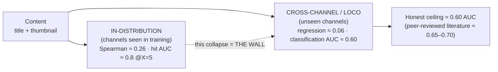
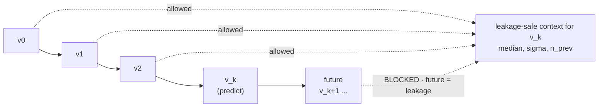
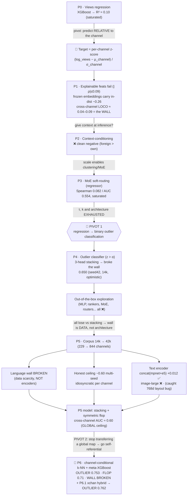
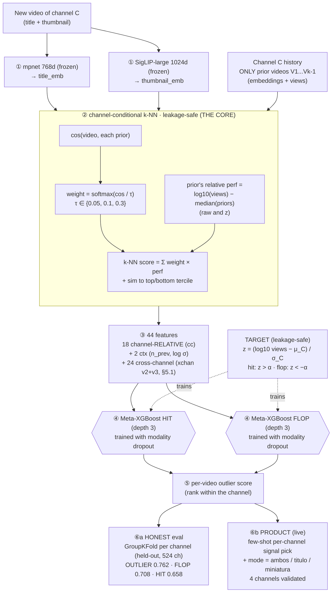
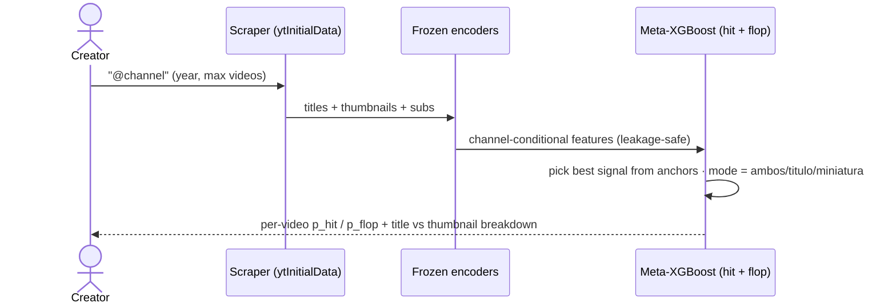

# MAVIS, predicting per-channel YouTube outliers

**Can you tell whether a video will over- or under-perform from just its title and thumbnail, before it's published?**

For a single *global* model the honest answer is **almost no**: every approach we tried hit a wall at around 0.60 AUC, consistent with the peer-reviewed literature. The thesis of this project is that **the wall is a limit of the global framing. The problem itself has more headroom.** Once we stopped transferring one "content to performance" rule across channels and predicted each video from the *content-similar prior videos of its own channel*, the wall broke.

> ### Headline result
> **Held-out per-channel OUTLIER AUC = 0.762** (winners vs losers, GroupKFold over 524 channels).
> FLOP **0.708**, HIT **0.658**. Thumbnail-alone reaches **0.747**, title-alone **0.720**, so each modality is independently usable.
> The global model that everything else converged to sits at **0.599 ± 0.016**, the "wall".
> The number came in two steps: channel-conditional k-NN (P6) broke the wall to OUTLIER **0.753**; cross-channel augment (xchan hybrid v2+v3) lifted it to **0.762** (+0.009 OUTLIER, +0.009 HIT).

This README is the **single consolidated record** of how we got there. It is deliberately written as a narrative of *what worked and every dead-end*, because in this project a well-measured negative result is a first-class outcome: each failed attack is an independent measurement of the wall, and together they are what make the final breakthrough credible.

**New here?** Read it as a two-act story:

- **Act I (§4, phases P0 to P5), "why the obvious thing fails."** We characterize the wall exhaustively and rule out architecture as the cause.
- **Act II (§5, phase P6), "what finally worked."** The reframe that sidesteps the wall entirely.

Jump to the **[Glossary (§13)](#13--glossary)** if a term is unfamiliar. Script index: [`scripts/README.md`](scripts/README.md). Literature synthesis: [`LITERATURE.md`](LITERATURE.md). Explainability deep-dive: [`explainability.md`](explainability.md).


## 1 · The notebooks

The story lives in five notebooks, in order:

1. [`01_eda.ipynb`](01_eda.ipynb) (Act I): EDA plus hand-crafted "explainable" features, and why they fail (channel-identity leakage).
2. [`02_first_approach_regression.ipynb`](02_first_approach_regression.ipynb) (Act I): the **first approach**, regressing the continuous z-score on frozen embeddings, with dedicated encoders, alternative heads, and every cross-channel wall attack (P1 to P3).
3. [`03_second_approach_classification.ipynb`](03_second_approach_classification.ipynb) (Act I): **the pivot** from regression to binary outlier classification (hits/flops), honest per-channel evaluation, and z-score lock-in (P4 to P5).
4. [`04_final_model.ipynb`](04_final_model.ipynb) (Act II): the **final model (P6 + P6.1)**, channel-conditional prediction with cross-channel augment that breaks the wall. Self-contained (features, training, eval, live demo). **OUTLIER AUC 0.762**.
5. [`05_explainability.ipynb`](05_explainability.ipynb): SHAP and a structural ablation over the final model's 44 features. Companion write-up in [`explainability.md`](explainability.md).

If you only have time for one, read **`04_final_model.ipynb`**: it runs end-to-end and contains the result. The first three notebooks are the evidence that the result is real and reproducible, and the fifth opens the model up.


## 2 · The problem

Given a YouTube **title and/or thumbnail**, predict how a video will perform **relative to its own channel**, against its own baseline. The target is a **per-channel log z-score**:

```
z = (log10(views) − μ_channel) / σ_channel
```

The model trains and is evaluated in z-space (centered at 0); the 1 to 10 number a creator sees is presentation only. We rejected absolute views and pure ranking on purpose: a 5k-subscriber channel and a 5M one are not comparable in raw views. The question *"did this video beat its own baseline?"* has the same meaning everywhere.

**Primary metric: per-channel AUC under held-out evaluation.** Can the model rank a channel's over-performers above the rest *for a channel whose calibration it learned honestly, without leakage*? This is the product-relevant measure. Aggregate AUC inflates the result, as §6 explains.

### The business objective

The decision this model supports is concrete: **before a creator invests hours producing a video, which idea is most likely to over-perform on their channel?** YouTube is a market north of USD 60 billion a year, and content teams (independent creators, agencies, and media companies) spend that budget largely on intuition about which title and thumbnail will land. A tool that ranks ideas *systematically better than chance* against a channel's own baseline lets that budget go to the ideas with the highest expected return, and lets the weak ones be dropped before production starts.

The technical output (a HIT / FLOP probability) becomes a business lever through two readings:

- **Prioritization.** Of the ideas the model flags as HIT, what fraction actually over-perform? That precision is what a creator acts on when deciding where to spend production time.
- **Avoided waste.** Of the ideas it flags as FLOP, how many really under-perform? Catching those early saves the production cost of a video that was going to under-deliver.

> **In progress.** The exact business-metric translation (top-K precision and lift expressed as hours saved or expected over-performance lift) is being finalized with real numbers. See §7 and the lift analysis in the notebook.

### The wall, in one picture



Within channels it has seen, content carries real signal. The moment it has to generalize to an *unseen* channel, that signal collapses, because the same title or thumbnail means different things on different channels. Act I characterizes this collapse from every angle. Act II refuses to transfer at all.


## 3 · Design decisions locked early (and why)

These were deliberate, and are easy to "simplify" away incorrectly:

1. **Per-channel z-score target.** We do not use absolute views or a global rank.
2. **Strict, leakage-safe channel context.** Any channel-history feature (trailing median, σ, momentum, cadence) for a video may use only videos published *before* it. Per-channel chronological cutoffs are enforced everywhere.
3. **Frozen embeddings plus a light head.** SigLIP-2 (thumbnail) and a multilingual sentence encoder (title) produce embeddings; we never fine-tune them, since with thousands of videos fine-tuning a backbone would overfit. Only an XGBoost head is trained.
4. **00-scraping from raw HTML `ytInitialData`**: no YouTube API, no keys, no quotas. Filter to recent videos, exclude shorts. Per video: title, videoId, thumbnail, published date, viewCount, channel subs.
5. **Content plus channel context only.** Per scope, only title and thumbnail (plus leakage-safe channel stats) are modeled, multilingual from the start.

The leakage-safe rule, visually: features for video *k* may use only the channel's videos published *before* it.



### The data, and how it grew

Scale was itself a research lever, so we rebuilt and expanded the corpus repeatedly to attack generalization. A broken first version (5 videos, 1 channel) was caught by degenerate nan/constant outputs from a scraper bug. v2 reached around 2,000 videos over 58 channels (the first usable set), and v3 grew to 2,717 over 86 channels as an explicit decision to attack generalization. A scale-up took it to 14,000 over 229 channels (about 5x the data, 2.7x the channels), and the current corpus is **42,000 videos over 844 channels**, the big push to break the wall.

**Cleaning policy (locked):** drop only `views == 0` (extraction artifacts, e.g. members-only). **Keep** virals, flops, and small channels: they carry real signal. Embeddings are precomputed and cached, keyed by `video_id`, so the rest of the pipeline aligns by join.


## 4 · Act I, characterizing the wall (P0 to P5)

> Read this act as a process of elimination. Each phase asks an obvious question, measures it honestly, and the answer is almost always "no, and here's exactly why." By the end, the wall is a *characterized result*, and the only remaining suspect is the framing itself.



### P0 to P1, what carries signal, and the wall appears

We began with the obvious question: *what predicts relative performance?*

- **Hand-crafted "explainable" features** (title length, caps, OCR text, YuNet faces, color, data-driven vocabulary) **do not predict** the target (|ρ| ≤ 0.09). What looked like signal was **channel-identity leakage**: a word is "good" only because one big channel happens to use it.
- **Frozen SigLIP-2 embeddings *do* carry in-distribution signal**: thumbnail Spearman ≈ **0.26** (R² ≈ 0.08), and it is genuine content signal. We verified it is not video-age or recency, using age-controlled partials and a mature-only subset.
- An early "the thumbnail is the only carrier" conclusion was later **corrected**: it was an *encoder artifact*. With a **dedicated text encoder** the **title also reaches ≈ 0.26** in-distribution. There are *two* real content signals.
- **But cross-channel is the wall.** Under LOCO, Spearman collapses to **0.04 to 0.09**, and no method or model tweak moved it. Within a channel the z-target is **temporally ≈ white noise** (autocorrelation ≈ 0), so predicting it across channels with this data is near-impossible.

Canonically, in the 2717/86 regime with frozen SigLIP (n ≈ 404): the SigLIP-text title (V2) gives 0.04 Spearman / ≈0 R²; the thumbnail (V3) gives 0.26 / 0.08; the concat of title and thumbnail (V4, 1536d) gives 0.24 / 0.07; and the **mean-pool champion (V6, 768d)** gives **0.28 / 0.08**.

Two non-obvious findings worth keeping: **V6 mean-pooling beats concat with half the dimensions** (in an *aligned* space, averaging denoises the signal, and the denser vector gives XGBoost less room to latch onto channel-identity directions, so V6 also generalizes slightly better, LOCO 0.020 to 0.068). The "title ≈ noise" reading was an encoder artifact; the title itself was fine. Lift was modest: top decile ≈ 1.42x, capturing about 39% of hits in the top-30% predicted.

### P2, give the model context at inference (clean negative)

**Hypothesis:** maybe `content → z` is conditional on the channel, so give XGBoost a *reference of 3 of the channel's videos* and ask "better or worse than these?"

Measured honestly, context **does not beat** the no-context baseline (≈ 0.062, weak), the ninth or so independent confirmation of the wall. The early "0.181" that looked like a crack was a **target artifact** (a `delta` target leaked the context's *level*). The killer detail: with a **foreign** channel's context the model predicts *better* than with the video's *own* context. If a "deviates-from-its-own-norm" signal existed it would be the opposite, so there is **no transferable own-channel novelty signal** at this stage.

### P3, experiments only scale enables

At 229 channels, niche clustering and Mixture-of-Experts became viable (they would overfit at 86):

- **At scale, per-channel fine-tuning and thumbnail late-fusion stop helping.** The old-regime model did not scale (0.131 to 0.040); it was a small/homogeneous-corpus artifact. The robust recommendation became the **generalist alone**.
- **MoE soft-routing** was the first scale lever to beat the global baseline (Spearman **0.082** / AUC **0.554**, +32% relative, n=161). The gain was modest, and **every architecture lever saturated**.
- **The literature agrees.** A 5-paper read ([`LITERATURE.md`](LITERATURE.md)) places the content-only ceiling at around 0.23 to 0.28 (regression framing). Notably the most on-topic paper (Cui et al. 2024), read rigorously, is evidence *for* our thesis: its dominant predictor is log-subscribers, that is *between-channel* variance, exactly what per-channel z erases.

### 🔑 Pivot 1, reframe the problem

The regressor was exhausted. The reframe: **stop predicting the continuous order; classify outliers binarily**, "will this video do *N times* the channel's typical?"

- **Leakage-safe labels:** for video *v* at position *k*, `median_prev` = median(log10 views) of `[0, k−1]`; `hit = log10(views) > log10(X) + median_prev` (symmetric `flop`), X ∈ {2,3,5}. Videos with fewer than 5 priors are filtered (unstable median).
- This **broke the wall the regressor never moved**: hit AUC **0.679 / 0.761 / 0.794** for X = 2/3/5. Same data, same eval, the loss now matches the product-relevant question.
- We then switched the label from multiplicative `X·median` to the **z-score threshold** `z > α` (adapts to each channel's variance), the locked target.

### P4, the stacking champion, and an exhaustive negative sweep

The champion was a **3x3 stacking ensemble**: 3 sub-models by modality (`title`, `thumb`, `combined`) times 3 heads (binary classifier, regressor, within-channel ranker) = 9 models, each fused by within-channel percentile rank then averaged. The gain comes from *decorrelated errors* across the heads; no single head carries it: **0.650 ± 0.134** per-channel AUC (seed 42, 14k regime), 13/29 channels above 0.7.

Then everything else lost or tied. The MLP and MLP+FiLM overfit (0.527 / 0.538) on 1500d over 10k rows; a standalone pairwise ranker (0.608) drowned in near-tied within-channel pairs; MoE clusters (0.560) suffered per-expert data starvation; the 9-model disagreement uncertainty signal was not significant because bad channels are "confidently wrong"; a day-of-week feature actually hurt (−0.010, the corpus is near-uniform and the ranker overfits); and routers / gated MoE (≤ 0.647) collapsed back to stacking because the experts were 80%+ correlated. **Lesson: the bottleneck is data. Architecture does not move it.** That conclusion justified the next move, tripling the corpus.

### P5, break the wall with data: 14k to 42k

We tripled the corpus (229 to **844 channels**) and re-measured honestly:

- **The "Spanish wall" came from data scarcity. English-biased encoders were not the cause.** `ρ(lang_es, AUC)` went from **−0.22** (a real penalty in P4) to **+0.06** (n.s.). With enough Spanish data, Spanish predicts as well as anything. The P4 linguistic diagnosis was *refuted*.
- **The honest ceiling is around 0.60 cross-channel AUC** (multi-seed baseline **0.599 ± 0.016** over about 104 test channels). The earlier 0.650 was optimistic: it came from 30 homogeneous tech-ish channels. Channel predictability is **idiosyncratic**: no observable feature explains it (|ρ| < 0.1).
- **Encoders (the remaining content lever):** **e5-large** title encoder helps (+0.021); **concat(mpnet + e5-large)** is best (**0.611 ± 0.008** vs 0.599, robust across all 3 seeds); **SigLIP2-large** thumbnails do *not* help (−0.013). The lever is the **text** encoder.
- A symmetric **flop** model (`z < −α`, just negate z) reuses everything: **0.580**, about 0.03 harder than hits, because a channel telegraphs its breakouts better than its flops.

> **Cautionary tale, the 768d layout bug.** The first encoder-swap results were absurd (`z mean` of −5.5 or −101, when it should be around 0). Cause: `_build_X` and about 25 eval scripts **hardcoded** the feature layout for `title=768 + thumb=768`, reading `meta_std` from fixed column 1538, so a different-dimension encoder shifts the layout and corrupts the labels. Fix: compute slices **dynamically** from each block's real width. Sanity rule kept forever: **`z mean train` must be around 0**, else the layout is broken.

**End of Act I.** The wall has been attacked about 9 independent ways (context, MoE, stacking, 3x data, encoder swaps) and stalled at around 0.60 every time, in line with the literature. Neither architecture nor data alone explains the wall. The one thing every attack shared was that it tried to **transfer a single content-to-performance mapping across channels.**


## 5 · Act II, breaking the wall (P6)

**The reframe that broke it: stop transferring, make the model self-referential.** For each video, predict its relative performance from the **content-similar PRIOR videos of its own channel**, a leakage-safe k-NN *inside* the channel. Each channel becomes its own reference, so there is nothing to transfer. This is also exactly what the product does: when you test a new video, the channel's history (and its views) are already known.

**The core signal, channel-conditional k-NN (leakage-safe).** For video *v* at position *k*, using only V₁...V_{k−1} of the same channel:

- weight each prior by `softmax(cos(emb_v, emb_prior) / τ)`;
- score = weighted mean of priors' relative performance `(log10 views − median)`, raw and z-normalized;
- temperatures **τ ∈ {0.05, 0.1, 0.3}**: low τ focuses on the single most-similar prior (diverse channels), high τ averages many priors (homogeneous / news channels); the meta picks per channel;
- plus cosine to the centroid of the top/bottom-tercile priors.

**The model.** 18 of these **channel-relative** features per video (2 modalities × 3 τ × {raw, z} = 12 kNN, plus `simtop`/`simbot`/`simdiff` × 2 modalities = 6 sim) plus 2 context (`n_prev`, log σ) and **24 cross-channel features** (the xchan augment described in §5.1), **44 features total**, feed a small **meta-XGBoost** (depth 3). Because the features are already normalized per channel, the meta **transfers to unseen channels**, which the raw-embedding model never could.



The one-liner: **"does this video look like what already worked (or flopped) on *its own* channel?"** That is all it computes, and it is why it transfers where a global model could not.

### Results

Per-channel AUC, held-out GroupKFold, 524 channels:

| metric | global XGBoost (P5) | channel-conditional (P6) | + xchan hybrid (P6.1) |
|---|---|---|---|
| **OUTLIER** (hit z>1 vs flop z<−1), *tell winners from losers* | n/a | 0.753 | **0.762** |
| **FLOP** (z<−1 vs rest) | 0.566 | 0.706 | **0.708** |
| HIT (z>1 vs rest) | 0.571 | 0.648 | **0.658** |

The OUTLIER metric, the real product question, clears **0.76**; FLOP clears **0.70**. HIT (vs the muddy middle) is the hardest direction: breakout hits are often *novel* topics, dissimilar to the channel's past, so a "similar-to-past" model is structurally weaker there. **The around-0.60 ceiling belonged to the global approach. The problem itself goes higher.**

Even an **untrained standalone k-NN** (no meta at all) beats the global XGBoost, about 0.62 hit / 0.69 flop vs 0.571 / 0.566, which is the cleanest evidence that the *reframe* drives the win; a heavier model is not needed.

### 5.1 · P6.1, cross-channel augment (xchan hybrid v2+v3)

Once channel-conditional broke the wall, the next question was whether *cross-channel* information could still help, *as long as it stays leakage-safe*. The answer is yes, modestly. The xchan augment adds, per video, **24 features** computed against the donor pool of all other channels' videos:

- **v2 (full pool, 12 feats):** top-K=30 most-similar videos from the full corpus (≈38k donors, the current video's own channel excluded). Their *z relative to their own channel* (not ours) is softmax-weighted at 3 temperatures and reduced to `(kNN_ti × 3τ, kNN_thl × 3τ, z_max_ti, z_std_ti, z_max_thl, z_std_thl, simtop_ti, simtop_thl)`.
- **v3 (channel-filtered pool, 12 feats):** identical, with the donor pool restricted to the **top-50 channels** most similar to the *query* channel by mean-of-embedding similarity. Helps niche / outlier channels for whom the global pool is too generic.
- **Hybrid concat (24):** both blocks together; the meta-XGBoost decides per channel when each helps.

These features are *not* candidates of the per-channel signal selection (§5.3). They feed only the meta-XGBoost. Tried as candidates, they overfit the small anchor set.

K-fold on 524 channels: **OUTLIER +0.009 (0.753 → 0.762)**, FLOP +0.002 (0.706 → 0.708), **HIT +0.009 (0.648 → 0.657)**. Notably, niche-comedy channels lift the most in the live tests (Metapod balanced-test +0.143). The xchan augment is the first improvement in roughly nine refutations after the channel-conditional pivot itself.

### What we measured along the way (several negative, all kept)

- **SigLIP-large beats SigLIP-base for thumbnails; SigLIP-base was dropped entirely.** `mpnet-title + SigLIP-large-thumb` only is at least as good as keeping both (OUTLIER 0.753 vs 0.747) and simpler.
- **A bigger title encoder does not help:** e5-large (1024d) is roughly equal to or worse than mpnet-base (768d). For within-channel *relative* similarity, embedding size is not the bottleneck.
- **Image-text fit `cos(thumbnail, title)`** (in SigLIP's shared space) is **null**, per-channel AUC ≈ 0.50. This re-confirms the literature "img-text congruence" feature as a false positive, now in the channel-conditional regime.
- **A user hypothesis, tested and debunked:** "do channels where the thumbnail differentiates performance grow bigger?" Across 474 channels, the thumbnail's within-channel predictive value does *not* correlate with subscriber count (Spearman −0.03, p ≈ 0.6). *Caveat:* this measures within-channel **predictability**. It does not measure absolute thumbnail **quality**, a causal question this deliberately channel-relative model does not touch.
- **Thumbnail-improvement campaign, four attacks, all refuted with shuffle tests.** Once we had the xchan-hybrid baseline, the next intuition (from YouTube practitioners) was that the *thumbnail* is the most important lever and the model must be under-using it. Four independent attacks were run with within-channel shuffle tests as sanity (`SHUF ≈ REAL → noise`):
  - **Title↔thumb cross-modal synergy** via SigLIP-text (`cos(title_siglip, thumb_siglip)` and z-normalized variants): real ΔOUT +0.0012, shuffle ΔOUT +0.0014 → **noise**. Re-confirms `cong` as a P0 false positive, now in the channel-conditional + xchan regime.
  - **DINOv2 / SigLIP+DINOv2 concat / PCA-256** as alternative thumbnail encoders: −0.024 / −0.013 / −0.017 vs SigLIP-large baseline. SigLIP + DINOv2 as dual k-NN blocks: +0.0002 (tie). The visual encoder is **not** the bottleneck.
  - **Hand-crafted features** (YuNet faces, OCR density, contrast, edges, symmetry, colorfulness; 36 numeric features over a 137-channel subset): real ΔOUT +0.011, shuffle ΔOUT +0.015 → **shuffle wins, refuted**. The same features used **alone** (no embeddings) give per-channel AUC **0.47**, below chance.
  - **Thumb-only / title-only / stacking diagnostic:** thumb-only K-fold = **0.747**, title-only = **0.720**; the full model is **0.762**. Adding the thumb-only OOF score as a feature to the full meta gives +0.001 → the meta already extracts everything the thumb can give. A meta-of-meta over only `{p_hit_title, p_flop_title, p_hit_thumb, p_flop_thumb, ctx}` reaches **0.759**, so the model is effectively low-rank.
- **The thumbnail is the dominant modality.** That inverts the original premise of the campaign: the title (0.720 alone) is the *weaker* modality, the thumbnail (0.747 alone) is the stronger. Practitioners are right about the thumbnail's importance; the implication for this model is the opposite of the one we expected, since the thumbnail signal is *already* what the model relies on.
- **Title-encoder attack with sanity test:** mpnet + e5 dual k-NN blocks passes a strict shuffle test in K-fold (REAL +0.0030 vs SHUF-within-chan +0.0007 vs SHUF-global −0.0027). On the 4-channel live test it averaged **−0.015** because the new candidates (`kNN-title-e5-highT`) destabilized the per-channel signal selection on ElArqui (−0.077). The +0.003 K-fold lift does not justify the operational cost (extra 159 MB cache, extra encoder loaded in RAM, longer cold-start) for a number that *breaks* in live, so the change was **not** shipped.

### 5.2 · Single modality plus modality dropout (product-critical)

The title-kNN and thumbnail-kNN are independent, so the model gives a useful prediction with **only a title, only a thumbnail, or both** (single-modality K-fold OUTLIER **0.720 / 0.747 / 0.762** for title-only / thumbnail-only / both). Training one meta with **modality dropout** (each video x3: title-masked, thumb-masked, both) yields a single model robust to a missing modality, at least as good as the separate single-modality models in all three modes. **A creator can validate a *title idea* before the thumbnail even exists.**

### 5.3 · Live demo, per-channel few-shot adaptation

The deployed predictor scrapes the channel's history, builds the same channel-conditional features, and on the channel's first videos (anchors, `K = max(10, round(0.5 × evaluable))`) **picks the channel-conditional signal that works best for that channel** from a 4-candidate set (`meta`, `kNN-title-highT`, `kNN-thumb-highT`, `kNN-all`), then applies it (`mode = ambos | titulo | miniatura`). The four reference channels used for live validation:

- **@Hector.Pulido** (~29k subs, broad dev / AI niche): held-out balanced OUTLIER in the 0.74 to 0.78 range; `meta` is selected.
- **@BaityLive** (~800k subs, gaming-news, low variance): held-out balanced OUTLIER ~0.64; `kNN-title-highT` is selected (news titles transfer most of the signal).
- **@ElArquiJuve3D** (sports-comment niche): held-out balanced OUTLIER ~0.63; `kNN-all` is selected.
- **@MetapodParaPresidenteTV** (comedy / commentary): held-out balanced OUTLIER 0.70 to 0.82, with xchan being a large lift for this niche channel (the donor pool of similar comedy channels carries useful information for the per-video score).



The full model is **self-contained in [`04_final_model.ipynb`](04_final_model.ipynb)**: the only external I/O is the live scraper cache.


## 6 · Honest findings (the thesis takeaways)

1. **Problem reformulation beats architecture, twice.** The two biggest jumps both came from re-stating the problem; a fancier model never produced one: regression to binary outlier classification (P4), then **global to channel-conditional / self-referential (P6)**. The latter broke the long-standing 0.60 wall to **OUTLIER AUC 0.753** held-out, lifted to **0.762** by the xchan augment (P6.1).
2. **The around-0.60 "ceiling" belonged to a *global* model. The problem has more headroom.** About 9 independent attacks all stalled at 0.60 because they all tried to *transfer* one content-to-performance mapping. Refusing to transfer sidesteps it. The literature ceiling (0.65 to 0.70) describes the *cross-channel transfer* framing; it does not bound the within-channel, self-referential framing.
3. **More data broke the *language* wall** (the Spanish penalty came from data scarcity; the encoders were not at fault). Per-channel predictability remains idiosyncratic. P6 still extracts real signal from most channels.
4. **Encoder *size* is not the lever, and the *visual* encoder is saturated.** SigLIP-large helps thumbnails over SigLIP-base. A bigger *title* encoder (e5-large) does not beat mpnet-base, and `cos(thumbnail, title)` is null (AUC 0.50). Replacing or augmenting SigLIP with DINOv2 (autosupervised, more discriminative cos within-corpus) **degrades** the model (−0.024 swap, +0.0002 dual block tie), and hand-crafted features (faces, OCR, contrast, edges) **fail a within-channel shuffle test**. For within-channel *relative* similarity, more representation does not help.
5. **The thumbnail is the *stronger* modality.** Single-modality K-fold: thumb-only **0.747**, title-only **0.720**. That inverts the intuition that the thumbnail "needs work"; the model already extracts the thumbnail's signal optimally (a thumb-only OOF score added as a feature to the full meta lifts +0.001). Practitioners are right that the thumbnail matters most; for this product, that means the thumbnail is *already* what the model relies on. SHAP confirms it: the thumbnail feature group carries the most attribution mass and the single strongest feature is a within-channel thumbnail kNN (see §7).
6. **The model is effectively low-rank.** A meta-of-meta over only `{p_hit_title, p_flop_title, p_hit_thumb, p_flop_thumb, n_prev, log σ}` reaches OUTLIER **0.759**, against the full 44-feature model's **0.762**. The 44 features collapse to 4 modality-scores plus context without losing much, which both validates the channel-conditional decomposition and confirms there is no headroom left in the current representation.
7. **Single modality is usable, and modality dropout makes it robust.** Title-only and thumbnail-only each clear 0.7 (OUTLIER); one meta trained with modality dropout handles all three modes, so the product works before a thumbnail exists.
8. **Measure honestly, including with shuffle tests.** Single-seed numbers inflate; "improvements" can be layout bugs (`z mean ≈ 0` is the canary); 0 subs can be a stale cache; for low-variance channels the reliable metric is the **balanced** (median-z split) OUTLIER, since the few-positive extremes are noisy. **For every candidate feature, we run a within-channel shuffle test: if shuffled ≈ real, the lift is XGBoost capacity, not signal.** Four refutations in the post-xchan phase came exclusively from this protocol. We document negatives as results.

### Three limitations, surfaced by the live demos (documented as results)

- **Aggregate AUC is much higher than per-channel AUC.** The P4 "lock-in" 0.755/0.803 numbers were *global* AUC (one `roc_auc_score` over all test videos), which measures *between-channel* separation and inflates by about 0.2. The product-relevant metric is **per-channel** AUC, which is around 0.55 to 0.63 for the global model. This is why per-channel AUC is the primary metric everywhere.
- **Video-age bias.** The model has no `age_days` feature; the training corpus is a single mature snapshot. Live videos 1 to 14 days old are still accumulating views, so they **systematically look like flops**. A `min_days_old` filter is noted and not yet shipped, an honest caveat for the live demo.
- **Consistent vs volatile channels.** For very consistent channels (views within about 4 to 5x) there are no real outliers at high thresholds, so AUC can be NaN. That is correct information ("no outliers here"). It is not a bug. The detector only has signal where there is internal variance to find.


## 7 · Explainability and feature influence

Two questions matter here: *which inputs carry the signal*, and *why the obvious interpretable ones do not*. The full analysis, with beeswarm, dependence, and waterfall plots, lives in [`explainability.md`](explainability.md) and [`05_explainability.ipynb`](05_explainability.ipynb); this is the summary.

**The interpretable features do not predict the target.** During EDA we built the features a human would reach for first: title length, keyword presence, number of faces in the thumbnail, brightness, capitalization, and similar hand-crafted descriptors. None of them showed a usable relationship with the per-channel z-score or with the HIT / FLOP label (|ρ| ≤ 0.09). What little correlation appeared turned out to be channel-identity leakage, a word looks "good" only because one large channel happens to use it. This is itself an explainability result: the clickbait heuristics creators trade in do not generalize across channels.

**The signal lives in the embeddings, and one feature reigns.** A SHAP pass (`TreeExplainer`, exact for XGBoost) over the 44 features of the meta-model ranks `knnz_thl_0.05` first for both directions: the within-channel kNN over SigLIP-large thumbnails, low temperature, z-normalized. Its dependence plot is a clean monotonic sigmoid. The reading is structural: what predicts a video's relative performance is *how similar its thumbnail and title are to the channel's own past hits and flops*, and the thumbnail block carries more of that signal than the title block (SHAP mass 0.385 vs 0.315 for HIT). This corroborates the headline that thumbnail-only retrieval reaches OUTLIER 0.747.

**SHAP and ablation tell different stories, and both are reported.** SHAP answers *what the trained model uses*; a structural ablation (drop a group, refit, re-evaluate on the same GroupKFold) answers *what the model needs*. They diverge in two instructive places:

- **`context` (just `n_prev` and `log_std`) is undervalued by SHAP and critical in ablation.** It is last by SHAP mass yet the second most damaging to remove (`Δ OUTLIER = −0.006`). Its role is calibration: it tells the trees *when* to trust the kNN features (more priors, more confidence; more variability, more dynamic range). Small per-prediction, load-bearing structurally.
- **The thumbnail similarity block (`cc-sim-thumb`) is redundant.** SHAP rates it 4th by mass. Removing it actually *improves* OUTLIER by `+0.004`, because it overlaps with the kNN features of the same modality. It is the strongest candidate for pruning in a future iteration.

**The model is asymmetric: sharper at flops than at hits.** On the same spine feature the SHAP contribution reaches `+2.0` for extreme flops versus `+1.3` for extreme hits. One "thumbnail very unlike the channel's past hits" signal is enough to call a flop with confidence, while one "very like past hits" signal does not exonerate symmetrically. This matches the headline numbers (FLOP AUC 0.708 > HIT AUC 0.658) and the narrative that breakout hits are usually *new* topics, dissimilar to the channel's past, so a similarity model cannot fully capture them.

The within-channel shuffle tests remain the complementary attribution method: for every candidate feature, real per-channel AUC is compared against AUC with values shuffled within the channel. If the two match, the lift came from XGBoost capacity and the feature carries no real signal. Four "improvements" were refuted exactly this way.


## 8 · From model to production (conceptual)

The model is already close to production: it is packaged in Docker and exposed through a web app (see [`03-platform/`](../03-platform/README.md)). The conceptual deployment story the brief asks for:

- **Real-time vs batch.** Two paths run side by side. **Scoring a single idea** (title and/or thumbnail against a channel) is a **real-time** request: encode, build channel-conditional features, run the two XGBoost heads, answer in well under a second once the encoders are warm. **Refreshing the corpus** (re-00-scraping the niche, recomputing embeddings) is a **batch** job that runs on a schedule.
- **Retraining cadence and trigger.** The current model is trained on ~800 channels from a single year (2026). In production it should **re-scrape periodically, focused on the niches the clients actually operate in**, and retrain when enough new in-niche material has accumulated or when held-out per-channel AUC drifts below a set threshold. A client onboarding a new niche is itself a trigger to scrape and refresh.
- **Drift monitoring.** Two signals to watch. First, **performance drift**: track held-out per-channel AUC on recent channels and alert if it falls below the ~0.76 OUTLIER baseline. Second, **input drift**: monitor whether the embedding distribution of newly scraped videos drifts away from the training corpus (titles and thumbnail styles change as formats evolve), which flags when a refresh is overdue.
- **Feature and model versioning.** Because the encoders are frozen and only the meta-XGBoost is trained, a new feature or a retrained head is a small, versioned artifact (`final_model.joblib`) tracked in a model registry alongside the embedding-cache version it was built against. The read-only mounts in the platform mean a new model is a swap of one file, with the previous version kept for rollback.


## 9 · Conclusions and future work

The central conclusion is that **problem framing, not model complexity, was the lever**: a self-referential, channel-conditional formulation cleared a ~0.60 cross-channel ceiling that ~9 global approaches could not move, reaching held-out OUTLIER AUC 0.762. The model is systematically better than chance at telling a channel's future over-performers from its under-performers, from title and thumbnail alone.

Future work, roughly in order of expected payoff:

- **More data and more channels**, scraped continuously and organized by niche, since data scarcity (not architecture) was the recurring bottleneck.
- **Internal creator signals.** The current model uses only public data. Adding a creator's own analytics (CTR, average view duration, retention) would bring signal the public view count cannot, and is the most promising single addition.
- **More expressive heads.** With a larger corpus, neural architectures over the channel-conditional features become viable without the overfitting that killed them at current scale.
- **Prune the redundant similarity features.** The ablation shows that dropping the thumbnail similarity block (`cc-sim-thumb`) slightly *improves* OUTLIER, so removing the redundant `cc-sim-*` features is a free simplification for the next iteration (six fewer features, metric held or improved).
- **Persistence and infrastructure.** Move the in-memory index to Postgres plus a vector database, and persist scraped channels as they come in, so the corpus grows naturally with use (see the P2 roadmap).


## 10 · Full experiment register

Every documented attack across the phases. Negatives are first-class results: each is an independent test of the wall. `inD` = in-distribution, `LOCO` = cross-channel.

### P1, regression: what carries signal, and the wall

| experiment | result | why |
|---|---|---|
| Explainable title/thumb features (Variant 1) | ❌ \|ρ\|≤0.09 | apparent signal = channel-identity leakage |
| Targets `z_per_day` / `z_detrend` / `z_gated` | ❌ | each worse than plain z-score; transforms destroy signal |
| Channel momentum / context features | ❌ not built | premise false: intra-channel z is AR(1)≈0 |
| Generalization A/B/C/D (group-val, residualize, pairwise, PCA/ridge) | ❌ | none move LOCO; some only close the gap by sinking inD |
| More channels (1988→2717) | ❌ | inD even dropped (0.27 was a small-corpus artifact) |
| SigLIP-large 384 | ❌ | marginal inD (+0.03), +48 min, V4 collapses → reverted |
| Multi-crop ×5 | ❌ 0.23 | dilutes thumbnail composition, encodes recency |
| `z_pctl` target | ❌ | reparametrizing the target fabricates no transferable signal |
| Small-channel benchmark | ⛔ infeasible | only 10 channels / 18 videos with <5 vids |
| Fusion geometries (max, \|diff\|, hadamard, mean+\|diff\|, α-sweep) | ❌ | **V6 mean-pool is the measured optimum** (α=0.5) |
| Dim reduction (PCA / PLS) | ❌ | none beat V6; rotation degrades axis-aligned trees |
| 3-class reframe (nb04) | ≈ | inD extremes AUC 0.666, but **LOCO ≈ chance** |
| **Dedicated text encoder mpnet (nb05)** | ✅ inD | **title 0.04→0.26**, "title=noise" was a SigLIP artifact; cross-channel still walled; intent anchors ❌ |
| Cross-space pooling (mpnet⊕SigLIP mean) | ≈ | matches V6 LOCO via another route; doesn't break wall |
| Dedicated image encoder DINOv2 (nb06) | ❌ | thumbnail signal is **semantic** (SigLIP) not compositional |
| Small MLP head + DANN/GRL adversarial (nb07) | ❌ | worse inD, LOCO≈floor; killing channel-identity doesn't help, so wall = **absence of signal**, not a shortcut |
| XGB feature reduction/reg (DART, colsample, random-subspace, RP vs PCA) | ❌ | only regularizes; wall is missing signal, not excess features |
| Few-shot retrieval (nb08) | ❌ | foreign support collapses; K=all LOO = **−0.40**, so the live signal is **novelty-relative-to-channel**, not similarity |

### P2, context at inference

| experiment | result | why |
|---|---|---|
| 3-video interchangeable reference | ❌ ~0.062 | no-context baseline not beaten; **foreign beats own** context |
| `delta` target (early "0.181") | ⚠️ artifact | model infers context level from its content; dissected |

### P3, scale-enabled (229 ch / 14k)

| experiment | result | why |
|---|---|---|
| Topic-cluster generalist (hard routing) | ❌ | toxic clusters drag the aggregate down |
| **MoE soft-routing (regressor)** | ≈ 0.082 / AUC 0.554 | first scale lever to beat global (+32% rel), but modest |
| τ-sweep / k-sweep | n/a | saturated (τ=0.1, k=8) |
| Arch sweep (per-video routing, thumb-in-experts, NNLS blend) | ❌ | all lose vs base V1 |
| Threshold sweep on MoE preds | ❌ flat | 0.54 to 0.57, no trend, so regressor order ≠ outlier separation |

### P4, the pivot: binary outlier classification

| experiment | result | why |
|---|---|---|
| **Binary outlier classifier (z>α)** | ✅ | **broke the wall**: hit AUC 0.68 / 0.76 / 0.79 (X=2/3/5) |
| Channel-relative delta features | ✅ (P4) | "atypical-within-channel" representation; later dropped for niche channels |
| Multi-seed bagging ×3 | ≈ +0.009 | within SEM, so not deployed |
| z-score label (vs ratio X·median) | ✅ +0.076 | per-channel, adapts to each channel's variance |
| Drop delta features (`no_delta`) | ✅ +0.011 | helps niche-archetype channels (HP 0.167→0.352) |
| α=0.5 train / α=1.0 eval | ✅ | sweet spot |
| Adaptive α (K=5 anchors) | ≈ | doesn't beat aggregate; good only for niche-archetype channels |

### P4, out-of-the-box on the stacking champion

| experiment | result | why |
|---|---|---|
| **Stacking 3×3 (binary+regressor+ranker)** | ✅ **CHAMPION** 0.650 | decorrelated-error ensemble; +0.019 over P5 base |
| MLP / MLP+FiLM | ❌ 0.527 / 0.538 | overfit |
| Pairwise ranker (standalone) | ❌ 0.608 | near-tied within-channel pairs = noise |
| MoE clusters (K-means + experts) | ❌ 0.560 | per-expert data starvation |
| Uncertainty (9-model disagreement) | ❌ | bad channels are "confidently wrong" |
| Day-of-week feature | ❌ −0.010 | corpus near-uniform; ranker overfits |
| Routers / gated MoE | ❌ ≤0.647 | experts 80%+ correlated, so blend ≈ stacking |

### P5, break the wall with data (42k / 844 ch)

| experiment | result | why |
|---|---|---|
| 3× corpus (14k→42k) | ✅ language wall / ❌ ceiling | Spanish penalty was data scarcity; content ceiling 0.60 stays |
| 768d layout bug | 🐞 fixed | hardcoded `X[:,1538]` corrupted every encoder swap |
| e5-large title encoder | ✅ +0.021 | stronger multilingual text helps (after fix) |
| **concat(mpnet + e5-large)** | ✅ **+0.012 robust** | best text encoder (multi-seed, all 3 seeds) |
| SigLIP2-large thumbnail | ❌ −0.013 | bigger image encoder doesn't help |
| Symmetric flop model (z<−α) | ✅ 0.580 | reuses everything; about 0.03 harder than hits |

### P6, channel-conditional (the wall-breaker, 42k / 844 ch)

| experiment | result | why |
|---|---|---|
| **Channel-conditional k-NN + meta-XGBoost** | ✅ **CHAMPION P6** OUTLIER 0.753 / FLOP 0.706 / HIT 0.648 | self-referential within-channel features transfer; global wall sidestepped |
| **xchan hybrid v2+v3 (24 cross-channel feats)** | ✅ **SHIPPED P6.1** OUTLIER 0.762 / FLOP 0.708 / HIT 0.657 | full + channel-similarity-filtered donor pools; +0.009 OUTLIER, +0.009 HIT; first lift in ~9 refutations |
| Standalone k-NN (no training at all) | ✅ ~0.62 hit / ~0.69 flop | even untrained it beats the global XGBoost (0.571 / 0.566) |
| Multi-temperature τ ∈ {0.05, 0.1, 0.3} | ✅ | low τ for diverse channels, high τ for homogeneous (news), meta picks |
| SigLIP-large thumbnail (drop SigLIP-base) | ✅ 0.753 vs 0.747 | large at least as good as base; dropping base is simpler |
| Bigger title encoder (e5-large / concat) | ❌ ≈ or < mpnet | size is not the lever for within-channel similarity |
| Image-text fit `cos(thumb, title)` | ❌ 0.50 | null per-channel; re-confirms false-positive feature |
| Maturity / age gating (≥30/45/60 d) | ❌ neutral | the z-target already compares to older (mature) priors |
| Universal-XGB blend (`BLEND_W`) | ❌ ≈ | does not beat meta-only, so `BLEND_W = 0` |
| Single modality (title-only / thumb-only) | ✅ 0.720 / 0.747 | each clears 0.7; **thumbnail is the stronger modality** |
| **Modality dropout (train each video ×3)** | ✅ | one model robust to a missing modality, at least as good as separate models |
| Few-shot per-channel signal pick (live) | ✅ | K=max(10, ⌊0.5·N⌋) anchors; selects best signal from 4 candidates |
| Thumbnail-lever vs subscriber count | ❌ ρ = −0.03 | tested a user hypothesis at scale (474 ch); no correlation |
| Title↔thumb SigLIP-text synergy `cong` (sanity) | ❌ noise | shuffle ΔOUT +0.0014 ≥ real +0.0012; re-confirms `cong` FP in cc+xchan regime |
| DINOv2 swap / concat / PCA-256 | ❌ −0.024 / −0.013 / −0.017 | visual encoder is **not** the bottleneck; SigLIP-large is saturated |
| SigLIP + DINOv2 as dual k-NN blocks | ❌ +0.0002 tie | adds no orthogonal information the meta can exploit |
| Hand-crafted thumb features (YuNet faces / OCR / color / edges) | ❌ shuffle wins; HC-alone AUC 0.47 | 36 numeric features fail shuffle test; below chance alone |
| Thumb-only / title-only diagnostic | diagnostic | thumb-only 0.747 > title-only 0.720; thumbnail is the stronger modality |
| Stacking (p_hit_thumb / p_hit_title as features into meta) | ❌ +0.001 | meta already extracts all the per-modality signal |
| Meta-of-meta over 4 OOF scores + ctx | ≈ 0.759 | model is effectively low-rank: 4 scores recover almost full 44-dim model |
| Title encoder e5 / SigLIP-text swap | ❌ −0.003 / −0.011 | both anisotropic in text↔text (cos within 0.83 / 0.86) |
| mpnet + e5 dual title k-NN blocks | ❌ live | K-fold +0.0030 with shuffle PASS (SHUF-chan +0.0007), live −0.015 (ElArqui −0.077): destabilizes signal selection; not shipped |


## 11 · How to run

**Final model (P6 + P6.1), the self-contained notebook.** Runs everything end-to-end (feature build, meta-XGBoost, held-out per-channel eval, live demo with `mode = ambos / titulo / miniatura`) and self-heals the frozen-encoder caches if missing:

```bash
# Run all cells; or just open it and "Run All".
jupyter nbconvert --to notebook --execute --inplace 01-classifier/04_final_model.ipynb
```

**Explainability (SHAP + ablation).** Depends on the artifacts produced by `04`:

```bash
pip install shap
jupyter nbconvert --to notebook --execute --inplace 01-classifier/05_explainability.ipynb
```

Legacy **P4/P5 scripts** (the global stacking model, kept for the experiment record):

```bash
# P5 champion eval (per-channel AUC, LOCO)
.venv/bin/python -u 01-classifier/scripts/eval_stacking.py                 # hits
.venv/bin/python -u 01-classifier/scripts/eval_stacking.py --direction flop

# Legacy live per-channel prediction (global stacking model)
.venv/bin/python -u 01-classifier/scripts/predict_universal.py "@channel" --year 2025

# Rebuild frozen-encoder embeddings (the notebook also does this automatically)
.venv/bin/python -u 01-classifier/scripts/build_embeddings.py
```

See [`scripts/README.md`](scripts/README.md) for the full script index.


## 12 · Reproduce the explainability artifacts

```
01-classifier/
  05_explainability.ipynb       ← run end-to-end (~5 min after caches are warm)
  explainability.md             ← companion write-up (what the model learned)
  explain_figures/
    shap_beeswarm_{hit,flop}.png
    shap_dep_{knnz_thl_0.05,knn_thl_0.05,simdiff_thl}.png
    shap_waterfall_{hit,flop}.png
    shap_importance.csv         ← per-feature mean |SHAP|, both directions
    ablation_groups.csv         ← per-group Δ AUC
```


## 13 · Glossary

Quick reference for the terms used throughout this log.

### Target & labels

| term | meaning |
|---|---|
| **per-channel z-score** | The target: `z = (log10 views − μ_channel) / σ_channel`. "How far is this video from its *own* channel's typical performance", in standard deviations. Centered at 0. |
| **μ_channel / σ_channel** | The channel's mean and standard deviation of `log10(views)`. Computed **leakage-safe** (prior videos only). |
| **hit / flop** | Outlier labels: **hit** = `z > α` (over-performs its channel), **flop** = `z < −α` (under-performs). Symmetric (flop = negate z). |
| **outlier** | A video far from its channel baseline in either direction (a hit or a flop). |
| **α (alpha)** | The z threshold that turns the continuous z into a label. `TRAIN_ALPHA=0.5` (train), `EVAL_ALPHA=1.0` (eval). |
| **X (multiplicative threshold)** | Older label form (pre-z): `hit = views > X · median`, X ∈ {2,3,5}. Replaced by the z-score. |

### Metrics

| term | meaning |
|---|---|
| **AUC** | Area under the ROC curve; here almost always **per-channel** (computed within each channel, then averaged). Chance = 0.50. |
| **per-channel vs global AUC** | *Per-channel* = within each channel then averaged (the product-relevant number). *Global* = concatenate all test videos into one AUC, inflated (about +0.2) because it also separates big from small channels. |
| **OUTLIER AUC** | Hits (`z>1`) vs flops (`z<−1`), ignoring the muddy middle, so "tell winners from losers". The headline product metric (**0.762** with xchan / 0.753 channel-conditional alone). |
| **HIT AUC / FLOP AUC** | `z>1` vs the rest / `z<−1` vs the rest. |
| **balanced (median-z split) AUC** | Top half vs bottom half of a channel's videos by z. Robust for low-variance channels (too few `z>1` extremes). |
| **Spearman ρ** | Rank correlation between predicted and true z (the regression-era metric, P1 to P3). |
| **lift / cumulative gain** | How many real hits land in the top-K predicted (e.g. "top decile ≈ 1.42x the base rate"). |
| **SE / multi-seed** | Standard error of the per-channel mean; *multi-seed* = averaging over random seeds to avoid single-seed inflation. |

### Evaluation protocol

| term | meaning |
|---|---|
| **leakage-safe** | A feature for video *k* may use **only** the channel's videos published *before* it, never the video itself or future ones. Enforced everywhere. |
| **held-out** | Channels (or videos) not seen during training, the honest test. |
| **LOCO** | Leave-One-Channel-Out: train on some channels, evaluate on entirely unseen ones. |
| **GroupKFold (per channel)** | Split eligible channels into *k* groups; rotate so each channel is evaluated **exactly once** while held out. Not leave-one-out (that would be about 844 trainings). |
| **in-distribution (inD)** | Channels seen in training (the easy regime). |
| **cross-channel / transfer** | Generalizing to *unseen* channels, the hard regime. |
| **eligible / evaluable** | *Eligible channel* = at least `MIN_VALID` (15) videos with at least `MIN_PREV` (5) priors. *Evaluable video* = has at least 5 prior channel videos. |
| **high/low-variance channel** | A channel with wide vs narrow view spread. Low-variance channels have few real outliers, so their AUC is noisier/lower by nature. |
| **shuffle test (within-channel)** | Sanity protocol for candidate features. Replace the feature with a within-channel permutation; if K-fold AUC is unchanged, the "improvement" was XGBoost capacity, not signal. Used to refute the post-xchan thumbnail-improvement campaign. |

### The wall & the final model (P6 / P6.1)

| term | meaning |
|---|---|
| **the wall** | The collapse of cross-channel generalization: a *global* content-to-performance model stalls at around 0.60 AUC because the same content means different things on different channels. |
| **channel-conditional / self-referential** | The fix: predict a video from the **prior videos of its own channel**, so there is no global mapping to transfer. Each channel is its own reference. |
| **within-channel kNN** | The core signal: a `softmax(cos/τ)`-weighted mean of the prior videos' relative performance, weighted by content similarity. |
| **xchan (cross-channel augment)** | 24 features added per video (P6.1) that use a **donor pool of other channels' videos**. Two flavors: **v2** uses the full corpus (≈38k donors, same-channel excluded); **v3** restricts donors to the top-50 channels most similar to the query channel by mean-of-embedding similarity. Each donor's z is *relative to its own channel*, so the augment is leakage-safe. The meta-XGBoost decides per channel when each block helps. Lifts OUTLIER 0.753 → 0.762. |
| **τ (temperature)** | Sharpness of the kNN softmax: low (0.05) focuses on the single most-similar prior (diverse channels); high (0.3) averages many priors (homogeneous / news channels). |
| **channel-relative features** | The 18 cc features fed to the meta-model, all already normalized per channel, which is why they **transfer** to unseen channels. |
| **meta-model** | The small XGBoost (depth 3) that combines the 44 features into the final hit/flop score. |
| **sim_top / sim_bot / sim_diff** | Cosine of a video to the centroid of the top / bottom tercile of its prior videos (by views), and their difference. |
| **modality dropout** | Train each video three times (title-only, thumbnail-only, both) so one model tolerates a **missing modality** at inference. |
| **few-shot per-channel adaptation** | At prediction time, use the channel's first videos (**anchors**) to pick the channel-conditional signal that works best for *that* channel. |
| **anchors** | The first K videos of a channel used to calibrate (the α and the signal choice). |
| **mode (both / title / thumbnail)** | Which modality the live demo predicts from. |

### Encoders & features

| term | meaning |
|---|---|
| **embedding** | A fixed-length vector from a pretrained encoder (here: title and thumbnail). |
| **frozen** | The encoder's weights are **not** trained, only the lightweight head (XGBoost) is. |
| **mpnet** | `paraphrase-multilingual-mpnet-base-v2`, the multilingual sentence encoder for **titles** (768-d). |
| **SigLIP / SigLIP-large** | Google's vision-language image encoder for **thumbnails** (`siglip2-large`, 1024-d). SigLIP-base (768-d) was dropped. |
| **e5-large** | `multilingual-e5-large`, a bigger text encoder that was tested and did **not** beat mpnet. |
| **DINOv2** | A self-supervised image encoder tested as an alternative to SigLIP for thumbnails. Degraded the model; the thumbnail signal is semantic, not compositional. |
| **image-text fit / `cong`** | `cos(thumbnail, title)` in SigLIP's shared space ("does the thumbnail match the title"). Null feature (per-channel AUC 0.50). |
| **structural / hand-crafted features** | Title and thumbnail stats (length, CAPS, faces, OCR, contrast, edges...). Fail a within-channel shuffle test; below chance alone. |
| **XGBoost** | Gradient-boosted decision trees, the trained head on top of frozen features. |

### Techniques explored (mostly P1 to P5)

| term | meaning |
|---|---|
| **stacking** | Ensemble of decorrelated heads (binary + regressor + ranker) fused by within-channel rank. The P4 champion. |
| **ranker (pairwise)** | A model trained on within-channel *pairwise order* (`rank:pairwise`). |
| **rank-fusion / within-channel percentile** | Convert each model's scores to per-channel ranks (0 to 1) before averaging, makes heterogeneous heads comparable. |
| **MoE (Mixture-of-Experts)** | Route each video to specialized sub-models (by topic cluster or learned gate). Saturated at scale. |
| **FiLM** | Feature-wise conditioning of an MLP on channel stats. Did not break the wall. |
| **DANN / GRL** | Domain-adversarial training (gradient-reversal) to erase channel identity. Did not help, confirming the wall is *absent signal*, not a shortcut. |
| **context-conditioning** | Giving the model a few of the channel's videos as a reference at inference (P2). Clean negative. |
| **maturity / age gating** | Filtering out very recent videos (still accruing views). Neutral here, the z-target already compares to older priors. |
| **meta-of-meta** | A small model over the per-modality OOF scores plus context. Reaches 0.759, showing the full model is effectively low-rank. |

### Data, 00-scraping & phases

| term | meaning |
|---|---|
| **ytInitialData** | The JSON blob embedded in YouTube's raw HTML; scraped directly (no API, no keys, no quotas). |
| **shorts** | Videos under 60 s, excluded from the dataset. |
| **subscribers / subs** | Channel size; used only for display and (formerly) the universal blend. |
| **P0 ... P6.1** | Project phases: P0 raw-views regression, P1 explainable feats plus the wall, P2 context, P3 MoE at scale, P4 binary outlier classifier plus stacking, P5 scale-up to 42k, **P6 channel-conditional (breaks the wall)**, **P6.1 xchan augment (0.762)**. |
