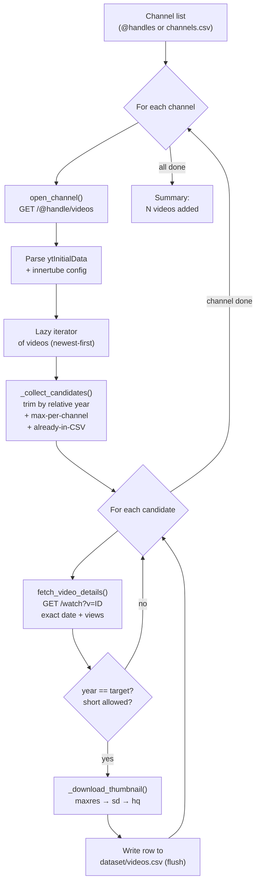
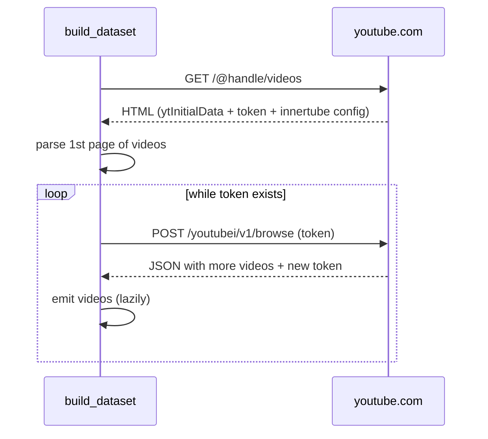
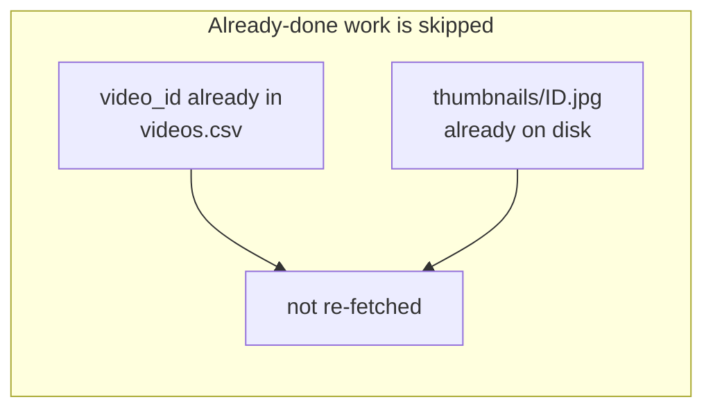
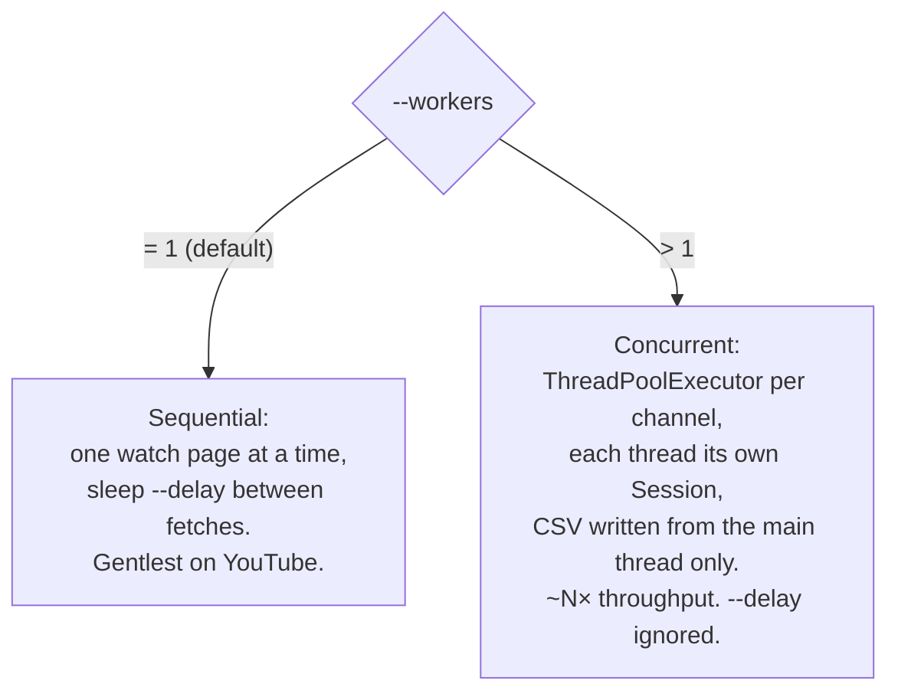

# `00-scraping/`: building the MAVIS dataset

This module builds the MAVIS video corpus **without the YouTube Data API**: no keys, no quotas, no third-party 00-scraping libraries. It rests on two moves:

1. **Parse YouTube's own public HTML.** The first request to a channel returns a `ytInitialData` block (the first page of videos), and further pages come from the internal *innertube* endpoint the web app itself uses. No API, no library.
2. **Open each video's watch page for the exact numbers.** The channel listing only gives a *relative* time ("3 months ago"), which is too coarse to tell 2026 from 2025 at the year boundary. So for every candidate the scraper reads the **exact publish date** and **exact view count** from the watch page.

The result is one CSV row per video plus a downloaded thumbnail, and the whole build is **idempotent and resumable**: interrupt it and re-run, and it picks up where it left off without duplicates.

> In short: filter to the target year, exclude shorts (under 60s),
>  and per video extract title, `videoId`, thumbnail, publish date, and view count.

### Quick start

```bash
cp channels.template.csv channels.csv     # then edit: one "handle,lang" per row
python -m 00-scraping.build_dataset --channels channels.csv --year 2026 --workers 8
```

Output lands in `dataset/videos.csv` and `dataset/thumbnails/`. Full options are
in Sections 7 and 8.


## 1. Files

| File | Role |
| --- | --- |
| `scraper.py` | **Low-level layer.** Opens a channel, parses `ytInitialData`, paginates via innertube, and resolves each video's exact details from its watch page. No on-disk state. |
| `build_dataset.py` | **Orchestrator / CLI.** Walks channels, decides which videos to keep (year, shorts, duplicates), downloads thumbnails, and writes `dataset/videos.csv`. Idempotent and resumable. |
| `channels.template.csv` | Channel-list template (`handle,lang`). Copy to `channels.csv`. |
| `dataset/videos.template.csv` | Reference header for the output CSV. |
| `dataset/videos.csv` | **Output** (git-ignored). One row per video. |
| `dataset/thumbnails/` | **Output** (git-ignored). `<video_id>.jpg` at the best available resolution. |

`build_dataset.py` consolidates what used to be two scripts (sequential and
concurrent) into one: the mode is chosen with `--workers`.


## 2. How it works

### 2.1 · Flow overview



### 2.2 · Pagination (innertube)

The first `GET` to `/@handle/videos` returns HTML with `ytInitialData`, which
holds only the **first page** of videos plus a *continuation token*. Subsequent
pages are requested via POST to the internal endpoint, reusing the
`INNERTUBE_API_KEY` and `INNERTUBE_CLIENT_VERSION` extracted from that same HTML.



Iteration is **lazy**: as soon as `_collect_candidates()` crosses a video "N
years ago" (`years` / `años`), it stops requesting pages, so a channel is never
crawled all the way to the end of its back-catalog.

### 2.3 · Why each video's watch page is opened

The channel listing only gives **relative** times ("3 months ago"), which are
not enough to tell 2026 from 2025 at the year boundary. So for every candidate,
`fetch_video_details()` opens `watch?v=ID` and reads from
`ytInitialPlayerResponse`:

- `publishDate` / `uploadDate`: exact ISO date and year,
- `viewCount`: exact integer view count,
- `lengthSeconds`: to confirm whether it is a short (under 60s).

This is the expensive step (one GET per video), which is exactly what concurrent
mode parallelizes.


## 3. Idempotency and resuming



Rows already present in `videos.csv` are **skipped** (not re-fetched), and
thumbnails already on disk are **not** re-downloaded. The CSV is opened in
*append* mode and `flush()`ed after each row, so an interrupted run resumes
without losing what was written or creating duplicates.

A useful consequence: you can start in sequential mode and resume in concurrent
mode (or vice versa) against the same CSV, because the schema is identical.


## 4. Execution modes

`--workers` selects the mode, and both produce byte-identical rows.



| | Sequential (`--workers 1`) | Concurrent (`--workers N>1`) |
| --- | --- | --- |
| Watch pages | one at a time, with `--delay` | pool of N threads |
| HTTP sessions | one per channel | one per thread (thread-local) |
| CSV writes | main thread | main thread |
| When to use | small jobs; many shards in parallel processes | a single machine, max throughput |


## 5. Usage

### Prepare the channel list

```bash
cp channels.template.csv channels.csv
# edit channels.csv: one row per channel, "handle,lang" (lang optional)
```

`handle` accepts an `@handle`, a full channel URL, or `channel/<ID>`. `lang` is
the `Accept-Language` for that channel; if left empty it uses the global `--lang`
(default `es-ES,es;q=0.9`).

### Run

```bash
# Sequential, current year, one or more @handles
python -m 00-scraping.build_dataset @Hector.Pulido @other

# Sequential, a specific year and a gentler delay
python -m 00-scraping.build_dataset @Hector.Pulido --year 2025 --delay 0.6

# Concurrent, channels from a file, 8 workers
python -m 00-scraping.build_dataset --channels channels.csv --year 2026 --workers 8

# Cap mega-channels to their 200 most-recent in-year videos
python -m 00-scraping.build_dataset --channels channels.csv --workers 6 --max-per-channel 200

# Include shorts (excluded by default)
python -m 00-scraping.build_dataset --channels channels.csv --include-shorts
```

> Run from the `00-scraping/` directory or as a module (`-m 00-scraping...`); the
> `scraper` import is relative to this folder.

### Quick scraper smoke test (writes nothing)

```bash
python -m 00-scraping.scraper @Hector.Pulido 10
```

Prints channel metadata and the first listed videos, handy to confirm parsing
works before a long build.


## 6. CLI options

| Flag | Default | Description |
| --- | --- | --- |
| `handles` (positional) | none | `@handles` or channel URLs (optional if `--channels`) |
| `--channels FILE` | none | CSV (`handle`/`channel`/`url` + optional `lang`) or a plain list, one `@handle` per line |
| `--year` | current year | Keep only videos from this year |
| `--out` | `dataset` | Output directory |
| `--include-shorts` | off | Keep shorts (under 60s); excluded by default |
| `--workers` | `1` | Concurrent fetches per channel (`1` = sequential) |
| `--delay` | `0.4` | Seconds between fetches in sequential mode (ignored when `--workers > 1`) |
| `--max-per-channel` | `0` | Cap on most-recent in-year videos per channel (`0` = unlimited) |
| `--lang` | `es-ES,es;q=0.9` | Global `Accept-Language` header |

The global language can also be set via the `MAVIS_ACCEPT_LANGUAGE` environment
variable (increasing priority: constant, then env var, then `make_session(...)`,
then `--lang`).


## 7. Output CSV schema

`dataset/videos.csv`, one row per video:

| Column | Meaning |
| --- | --- |
| `video_id` | YouTube ID (key for dedup/resume) |
| `channel_handle`, `channel_name`, `channel_id` | Channel identity |
| `subscribers` | Channel subscribers (parsed from the header) |
| `title` | Exact title (from the watch page) |
| `published_at` | Exact ISO date `YYYY-MM-DD` |
| `published_human` | Human-readable date, e.g. `16 March 2026` |
| `published_relative` | Relative time from the listing ("3 months ago") |
| `year` | Publication year |
| `views` | Exact view count (integer) |
| `length_seconds` | Duration in seconds |
| `is_short` | `True` if under 60s / flagged as a Short |
| `url` | Watch URL |
| `thumbnail_url` | URL of the thumbnail actually downloaded |
| `thumbnail_path` | Local path under `dataset/thumbnails/` |
| `scraped_at` | ISO timestamp of 00-scraping |

Thumbnails are downloaded at the best available resolution, following the
`maxresdefault → sddefault → hqdefault` chain (never the degraded `0.jpg`), and
gray-placeholder or corrupt images are discarded (validated with OpenCV if
installed, otherwise by byte size).


## 8. Operational notes

- **Politeness:** in sequential mode `--delay` spaces fetches apart; in
  concurrent mode `--workers` bounds the parallelism. Be conservative with large
  channels.
- **Sharding:** to spread work across machines, split `channels.csv` into several
  files and launch one process per shard. Because the build is idempotent, shards
  can even share the same output CSV.
- **Robustness:** a channel that fails to open, or a video whose watch page
  cannot be parsed, is reported on `stderr` and skipped; the build continues.


## 9. Ethics of 00-scraping

This module reads YouTube's **public** web pages, the same HTML a logged-out
browser receives. The corpus feeds an academic thesis (MAVIS / TFM). That
context shapes a handful of self-imposed rules. YouTube does not enforce them.
The absence of an API key does not remove responsibility for how the public
site is accessed.

- **Public data only.** Only pages reachable without logging in are touched:
  channel listings, watch pages, thumbnails. No private playlists. No
  age-gated content. No endpoint that requires an account or cookies.
- **No credentials, no impersonation.** The scraper does not log in. It does
  not replay session cookies. It does not pretend to be a specific user. The
  `User-Agent` is a standard browser string so the server returns a parseable
  page. Pages behind authentication are out of scope.
- **Read-only.** The scraper never comments, likes, subscribes, or reports.
  It issues `GET` requests, plus one internal `POST` for pagination (the same
  call the web app makes for itself).
- **Be gentle on the origin.** `--delay` in sequential mode and a bounded
  `--workers` pool in concurrent mode exist to keep request rates modest.
  Prefer the smallest worker count that finishes in acceptable time. Lazy
  iteration (Section 2.3) already stops the crawl as soon as it crosses the
  target year, so back-catalogs are never traversed to the end. Avoid raising
  `--workers` to "saturate" a channel.
- **Take only what the research needs.** The CSV schema (Section 7) lists the
  minimum needed to build the MAVIS corpus: identifiers, title, publish date,
  views, length, and one thumbnail per video. No transcripts. No comments. No
  viewer-level data. No descriptions beyond what the listing yields.
- **Thumbnails are copyrighted material.** They belong to their creators.
  They are stored locally because the MAVIS pipeline needs the pixels to
  compute embeddings. They are never redistributed, and `dataset/thumbnails/`
  is git-ignored on purpose. When results are published, show thumbnails only
  in the limited, transformative context of error analysis or qualitative
  examples, always with attribution to the channel. Neither titles nor
  thumbnails are used to produce derivative content. The aim of MAVIS is to
  build a tool that helps content creators themselves: predicting how a
  title or thumbnail might perform, and surfacing similar real videos so the
  creator can learn from them.
- **Creator attribution and right to be excluded.** The dataset always keeps
  `channel_handle`, `channel_name`, and `url`, so any reported result can be
  traced back to its source. If a creator asks to be removed, drop the
  channel from `channels.csv`, delete its rows from `dataset/videos.csv`,
  and remove its thumbnails from `dataset/thumbnails/`. The build is
  idempotent, so the next run is consistent again.
- **Research use only.** This scraper is part of a master's thesis about
  predicting and retrieving videos. It is not a service offered to third
  parties. Re-purposing it for commercial monitoring, for surveillance of
  specific creators, or for any use that conflicts with YouTube's Terms of
  Service falls outside the scope this module was built for.
- **Reproducibility over re-00-scraping.** The build is idempotent and resumable
  (Section 3). When collaborators need the data, share the resulting CSV
  (within the limits above). Re-crawling the same channels duplicates load on
  YouTube without adding new information.

If YouTube changes its HTML in a way that breaks parsing, the right response
is to update the parser. Adding retries, header rotation, or proxy pools to
push through would cross from "reading the public site" into "evading a
signal that we should slow down or stop."


## 10. Glossary

Quick reference for the terms used in this module.

### 00-scraping mechanics

| term | meaning |
|---|---|
| **YouTube Data API** | Google's official API for video metadata. Deliberately *not* used here: it needs keys and imposes daily quotas. This module reads the public site directly. |
| **ytInitialData** | The JSON blob embedded in a channel page's raw HTML. Holds the first page of videos plus the continuation token and innertube config. |
| **innertube / youtubei** | The internal API the YouTube web app calls for itself (`/youtubei/v1/browse`). Used here only to fetch further pages, reusing the keys found in the page's own HTML. |
| **continuation token** | An opaque cursor returned with each page; POSTing it asks innertube for the next batch of videos. Pagination ends when no token comes back. |
| **watch page** | A single video's page (`/watch?v=ID`). Opened per candidate to read exact data the listing lacks. |
| **ytInitialPlayerResponse** | The JSON block on the watch page that carries the exact publish date, view count, and length. |
| **lazy iteration** | Videos are emitted page by page and the crawl stops as soon as it crosses the target year, so a channel is never read to the end. |

### Build behavior

| term | meaning |
|---|---|
| **idempotent** | Running the build again produces the same result and adds no duplicates; already-scraped rows and existing thumbnails are skipped. |
| **resumable** | The CSV is appended and flushed per row, so an interrupted run continues without losing or repeating work. |
| **sequential vs concurrent** | Execution modes chosen by `--workers`: one watch page at a time (gentle) vs a thread pool per channel (fast). Both write byte-identical rows. |
| **session (HTTP)** | A persistent `requests` connection with its own headers. One per channel in sequential mode, one per thread in concurrent mode. |
| **sharding** | Splitting the channel list across files/machines and running one process per shard. Safe to share one output CSV because the build is idempotent. |

### Data & filters

| term | meaning |
|---|---|
| **handle** | A channel's `@name`; the scraper also accepts a full URL or `channel/<ID>`. |
| **short** | A video under 60 seconds (or flagged as a Short). Excluded by default; `--include-shorts` keeps them. |
| **relative vs exact date** | The listing gives a relative time ("3 months ago"); the watch page gives the exact ISO date. The reason every watch page is opened. |
| **Accept-Language / lang** | The HTTP language header sent per channel; affects how dates and labels are localized. Defaults to Spanish. |
| **thumbnail resolution chain** | The order tried when downloading a thumbnail: `maxresdefault`, then `sddefault`, then `hqdefault`, never the degraded `0.jpg`. |
| **max-per-channel** | A cap on how many recent in-year videos to keep per channel, to stop mega-channels from dominating the corpus. |
