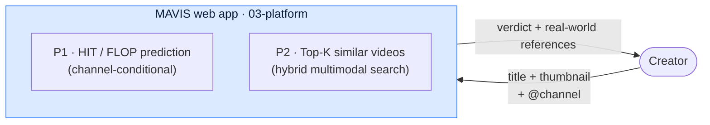
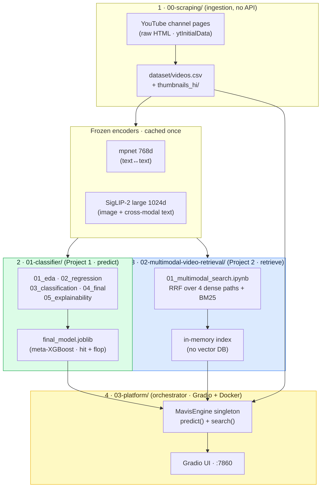
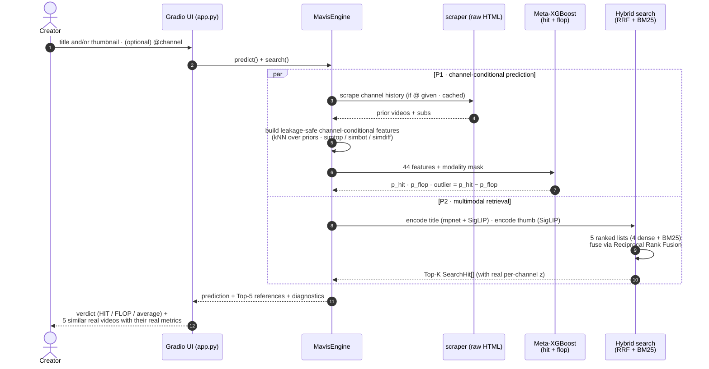
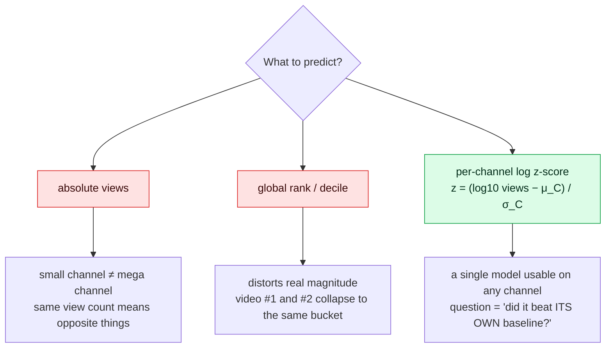
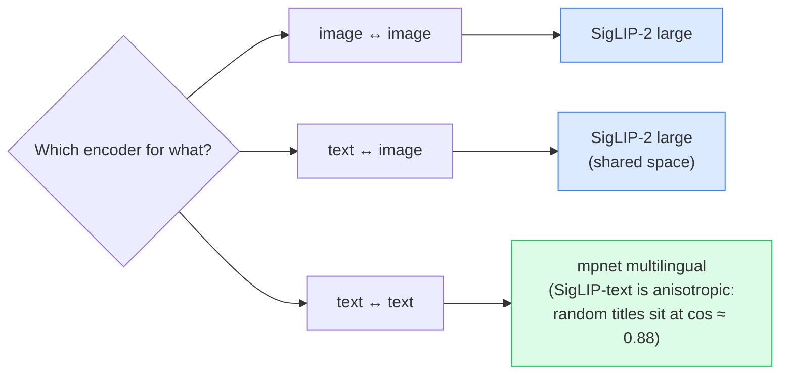
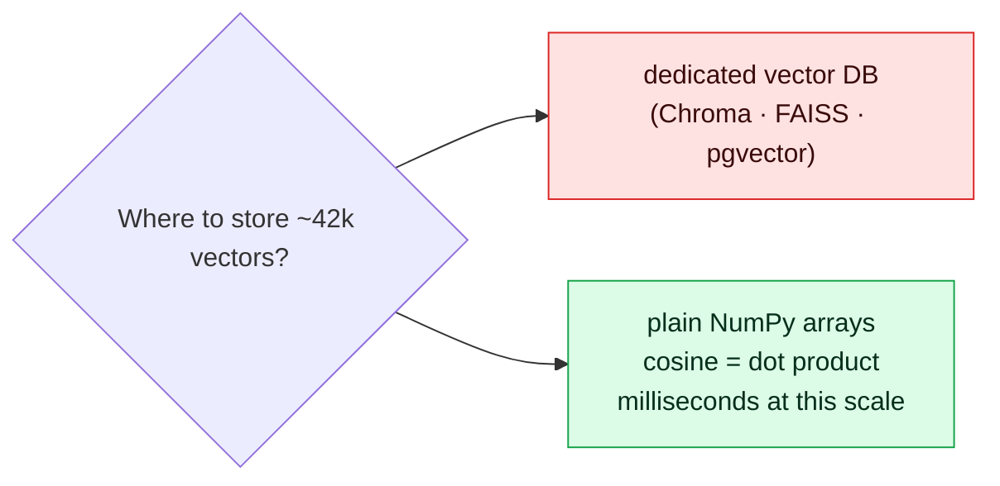
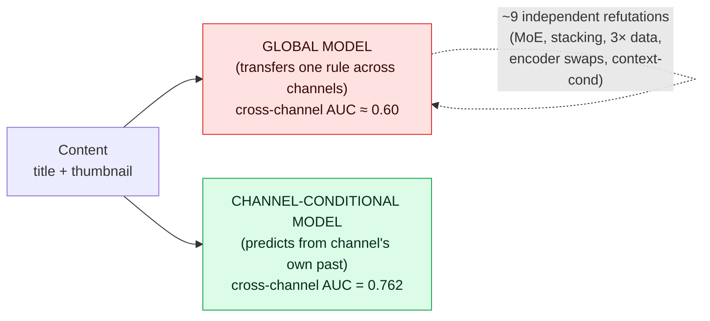
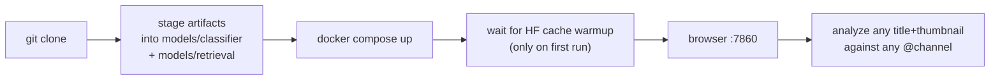
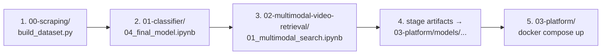

# MAVIS · Multimodal Audiovisual Indexed Score

> **Before publishing a YouTube video, two questions matter most: *is this idea good for **my** channel?*, and *what already exists like it?*** MAVIS answers both, from just a **title** and/or a **thumbnail**.

MAVIS is one system split into two coupled deliverables that share one dataset and ship as one Dockerized web app:

- **Predict** how a video will perform **relative to its own channel** (per-channel HIT / FLOP probability).
- **Retrieve** the already-published videos most similar to a new idea, on both the *hook* (title) and the *implementation* (thumbnail).


## TL;DR



| What | Headline number | Where it lives |
|---|---|---|
| **Per-channel OUTLIER AUC** (winners vs losers, GroupKFold over 524 channels) | **0.762** | [`01-classifier/`](01-classifier/README.md) |
| FLOP AUC / HIT AUC | 0.708 / 0.658 | [`01-classifier/`](01-classifier/README.md) |
| Title-only / Thumbnail-only OUTLIER AUC | 0.720 / 0.747 | [`01-classifier/`](01-classifier/README.md) |
| Hybrid search Recall@5 / MRR (gold set, 16 queries) | **0.41 / 0.88** | [`02-multimodal-video-retrieval/`](02-multimodal-video-retrieval/README.md) |
| Corpus size | **~42k videos · 844 channels** | [`00-scraping/`](00-scraping/README.md) |
| End-to-end runnable | `docker compose up --build` | [`03-platform/`](03-platform/README.md) |

The headline result is a reframing claim. The around-0.60 AUC ceiling that the literature reports for cross-channel YouTube prediction is a limit of the **global framing**. The problem itself has more headroom once you stop transferring one mapping across channels. That is a stronger contribution than a better encoder would have been.


## 1 · The system on one page

Four modules, one dataset, one running app. Each module has its own deep-dive README; this map is the entry point.



| Module | Role | Output |
|---|---|---|
| [`00-scraping/`](00-scraping/README.md) | API-less ingestion from raw `ytInitialData` HTML. Idempotent and resumable. | `dataset/videos.csv` + `thumbnails_hi/` |
| [`01-classifier/`](01-classifier/README.md) | Project 1. The full research narrative from "the wall" to a self-referential channel-conditional model. | `final_model.joblib` |
| [`02-multimodal-video-retrieval/`](02-multimodal-video-retrieval/README.md) | Project 2. Two encoders, four comparison paths, RRF fusion, BM25 hybrid layer. | In-memory cosine index over the same corpus |
| [`03-platform/`](03-platform/README.md) | Dockerized Gradio app that wires P1 and P2 together over the read-only artifacts. **No retraining.** | `http://localhost:7860` |


## 2 · The user flow

What actually happens when a creator submits an idea:



The two projects compose. The **prediction** tells the creator how their idea would land *on their channel*, and the **retrieval** grounds that prediction in real published references they can study.


## 3 · Why these design choices

Three decisions justify themselves immediately, and three more are explained at length in the subfolder READMEs.







The remaining decisions (per-channel chronological cutoffs to prevent leakage, frozen encoders with a tiny trained head, 00-scraping via raw `ytInitialData` in place of the YouTube Data API) are unpacked where they matter.


## 4 · The result, the wall, and the breakthrough

For a single **global** model, the answer to *"can title + thumbnail predict cross-channel performance?"* is honestly **almost no**: every architecture we tried stalled at ~0.60 AUC, consistent with the peer-reviewed literature (synthesis in [`01-classifier/LITERATURE.md`](01-classifier/LITERATURE.md)).

The thesis is that **this wall belongs to the global framing. The problem itself has more headroom.** Once the model stops transferring a single "content → performance" rule across channels and instead predicts each video from the **content-similar prior videos of its own channel**, the wall breaks.



| Metric (held-out GroupKFold, 524 channels) | Global XGBoost (P5) | Channel-conditional (P6) | **+ xchan hybrid (P6.1, shipped)** |
|---|---|---|---|
| **OUTLIER** (hit `z>1` vs flop `z<−1`), *tell winners from losers* | n/a | 0.753 | **0.762** |
| **FLOP** (`z<−1` vs rest) | 0.566 | 0.706 | **0.708** |
| HIT (`z>1` vs rest) | 0.571 | 0.648 | **0.658** |

The full narrative, including every negative result and the within-channel shuffle tests that refute four "improvements", is in [`01-classifier/README.md`](01-classifier/README.md). It is deliberately written as a story of *what worked and every dead-end*, because in this project a well-measured negative is a first-class outcome.


## 5 · Quick start

There are two ways in: **the web app** (instant gratification) or **the notebooks** (the full story).

### Option A · run the web app (Docker)

```bash
git clone https://github.com/HectorPulido/MAVIS-Youtube-Video-Optimizer
cd MAVIS-Youtube-Video-Optimizer/03-platform

# Stage the trained model and caches the app mounts read-only.
# These are notebook outputs and are not committed to the repo.
mkdir -p models/classifier models/retrieval
cp ../01-classifier/{embeddings.npz,embeddings_siglip_large.npz,text_emb.npz,xchan_hybrid_cache.npz,final_model.joblib} models/classifier/
cp ../02-multimodal-video-retrieval/cache/{title_emb_mpnet_raw.npz,title_emb_siglip2_large.npz} models/retrieval/

docker compose up --build
# open http://localhost:7860
```

The `models/classifier/` and `models/retrieval/` folders hold artifacts produced by the notebooks (Option B), so they are not in the repository. Copy them into place first; the Compose service mounts both folders read-only. If you have not run the notebooks yet, do Option B first, or obtain the released artifact bundle.

First run downloads SigLIP-large plus mpnet into a named volume (`~3 GB`, 5 to 15 min on a slow connection). Subsequent starts take ~30 s.



### Option B · reproduce the research



```bash
# 1 · build the corpus (idempotent, resumable; ~hours depending on channels)
python -m 00-scraping.build_dataset --channels 00-scraping/channels.csv --year 2026 --workers 8

# 2 · final model (self-contained: features + training + held-out eval + live demo)
jupyter nbconvert --to notebook --execute --inplace 01-classifier/04_final_model.ipynb

# 3 · multimodal search (self-contained: regenerates caches if missing)
.venv/bin/jupyter nbconvert --to notebook --execute --inplace \
  --ExecutePreprocessor.kernel_name=mavis-venv \
  02-multimodal-video-retrieval/01_multimodal_search.ipynb

# 4 · stage the notebook outputs into the folders the app mounts
mkdir -p 03-platform/models/classifier 03-platform/models/retrieval
cp 01-classifier/{embeddings.npz,embeddings_siglip_large.npz,text_emb.npz,xchan_hybrid_cache.npz,final_model.joblib} 03-platform/models/classifier/
cp 02-multimodal-video-retrieval/cache/{title_emb_mpnet_raw.npz,title_emb_siglip2_large.npz} 03-platform/models/retrieval/

# 5 · wire it all into the app
cd 03-platform && docker compose up --build
```

Each subfolder README documents its own CLI flags, caches, and operational notes.


## 6 · What you see

The Gradio UI returns three things side-by-side: the **Top-5 most-similar real videos** (each with its real per-channel z-score, color-coded), the **HIT / FLOP verdict** for the idea, and, if a channel handle was provided, a **per-channel diagnostic panel** with the three per-direction AUCs and the adaptive-signal pick.

| Prediction card (right sidebar) | Channel diagnostic table |
|---|---|
|  |  |

Color palette (single source of truth, used by both the result cards and the channel table, `app.py::_zscore_palette()`):

| Condition | Label | Color |
|---|---|---|
| `z ≥ 1.5` | ★ MEGA HIT | deep green |
| `z ≥ 1.0` | HIT | green |
| `z ≥ 0.3` | ↑ above average | light green |
| `−0.3 < z < 0.3` | channel average | gray |
| `−1.0 < z ≤ −0.3` | ↓ below average | light red |
| `−1.5 < z ≤ −1.0` | FLOP | red |
| `z ≤ −1.5` | ▼ MEGA FLOP | deep red |


## 7 · Repository layout

```
MAVIS-Youtube-Video-Optimizer/
├── README.md                               ← you are here
├── enunciado_TFM_MDATA2-.pdf               ← the TFM brief
├── papers/                                 ← literature read for the project
│
├── 00-scraping/                               ← 1. ingestion (no API)
│   ├── scraper.py · build_dataset.py
│   ├── channels.csv (templated)
│   ├── dataset/videos.csv + thumbnails_hi/
│   └── README.md                           ← deep-dive
│
├── 01-classifier/                          ← 2. Project 1 · predict
│   ├── 01_eda.ipynb
│   ├── 02_first_approach_regression.ipynb
│   ├── 03_second_approach_classification.ipynb
│   ├── 04_final_model.ipynb                ← run this one if you only have time for one
│   ├── 05_explainability.ipynb             ← SHAP + structural ablation
│   ├── final_model.joblib
│   ├── explainability.md                   ← what the model actually learned
│   ├── LITERATURE.md                       ← 5-paper synthesis
│   ├── scripts/                            ← legacy P4/P5 + live predict tools
│   └── README.md                           ← deep-dive (the research narrative)
│
├── 02-multimodal-video-retrieval/          ← 3. Project 2 · retrieve
│   ├── 01_multimodal_search.ipynb
│   ├── eval_queries.json                   ← hand-annotated gold set
│   ├── cache/
│   └── README.md                           ← deep-dive
│
└── 03-platform/                            ← 4. orchestrator · the running app
    ├── mavis_engine.py                     ← MavisEngine singleton
    ├── app.py                              ← Gradio UI
    ├── Dockerfile · docker-compose.yml · .env.example
    └── README.md                           ← deep-dive
```


## 8 · Findings, in one screen

The deep dives have the full evidence; this is the elevator pitch.

1. **Problem reformulation beats architecture, twice.** Both real jumps came from re-stating the problem (regression → binary outlier classification; global → channel-conditional). A fancier model never produced one.
2. **The ~0.60 AUC "ceiling" belonged to a global framing. The problem has more headroom.** ~9 independent attacks all stalled there because they all tried to *transfer* one content-to-performance mapping. Refusing to transfer sidesteps it.
3. **Encoder *size* is not the lever, and the *visual* encoder is saturated.** SigLIP-large beats SigLIP-base; e5-large does not beat mpnet for titles; DINOv2 and hand-crafted thumbnail features fail within-channel shuffle tests.
4. **The thumbnail is the *stronger* modality.** Thumb-only AUC 0.747 beats title-only 0.720, and SHAP confirms it: the thumbnail feature group carries more attribution mass than the title group, and the single strongest feature is a within-channel thumbnail kNN. The practitioners' intuition is right.
5. **The model is sharper at flops than at hits.** SHAP reaches +2.0 on extreme flops versus +1.3 on extreme hits for the same feature, matching FLOP AUC 0.708 > HIT AUC 0.658: a thumbnail unlike the channel's past hits is strong flop evidence, while breakout hits are often new topics a similarity model cannot foresee.
6. **The model is effectively low-rank.** A meta-of-meta over 4 OOF scores plus 2 context features recovers 0.759 of the full 44-feature 0.762.
7. **Single-modality is usable.** Title-only and thumbnail-only each clear 0.7, so the product can validate an idea *before the thumbnail exists*.
8. **Measure honestly, including with shuffle tests.** Report per-channel AUC; global AUC inflates by ~0.2. Average over seeds; single-seed numbers mislead. Run a within-channel shuffle test for every candidate feature: if the shuffled scores match the real ones, the lift came from XGBoost capacity and carries no real signal. Negatives are documented as results.

### Three limitations, surfaced by the live demos

- **Video-age bias.** No `age_days` feature; videos 1 to 14 days old are still accruing views and look like flops.
- **Consistent vs volatile channels.** For very consistent channels (~4 to 5× view spread) there are no real outliers at high thresholds, so AUC can be NaN. That output is correct information about the channel. The detector only has signal where there is internal variance to find.
- **Synthetic-channel fallback.** Without a handle, the prediction uses the K nearest corpus videos as fake priors. The signal is approximate, and the UI flags it.


## 9 · Roadmap

Grouped by horizon and expected payoff, with no fixed dates.

```mermaid
flowchart LR
    subgraph NEAR["Near term"]
      direction TB
      A1["P2 · cross-encoder re-ranking<br/>(measure quality vs latency)"]
      A2["P1 · min_days_old filter<br/>(fix the video-age bias)"]
    end
    subgraph MID["Medium term"]
      direction TB
      B1["P2 · LLM-as-judge over<br/>a larger query set"]
      B2["P2 · bigger annotated<br/>gold standard"]
      B3["P1 · continuous niche 00-scraping<br/>+ scheduled retraining"]
    end
    subgraph LONG["Longer term"]
      direction TB
      C1["P1 · internal creator signals<br/>(CTR, retention)"]
      C2["P1 · neural heads<br/>(once the corpus is larger)"]
      C3["Infra · Postgres + vector DB,<br/>persist scraped channels"]
    end

    NEAR --> MID --> LONG

    classDef n fill:#dcfce7,stroke:#16a34a,color:#052e1b;
    classDef m fill:#dbeafe,stroke:#3b82f6,color:#0b1f3d;
    classDef l fill:#fef9c3,stroke:#eab308,color:#3a2a05;
    class A1,A2 n;
    class B1,B2,B3 m;
    class C1,C2,C3 l;
```



The single highest-payoff addition is **internal creator signals**: the current model uses only public data, so a creator's own analytics (CTR, average view duration, retention) would bring signal the public view count cannot.

One thing is deliberately *not* on the roadmap: tuning the embedding backbones any further. They are saturated for *within-channel relative* similarity, which is what this product needs.


## 10 · Glossary

Cross-cutting terms used across the whole repository. Each subfolder README has its own deeper glossary.

| term | meaning |
|---|---|
| **per-channel z-score** | The target: `z = (log10 views − μ_channel) / σ_channel`. How far a video is from its own channel's typical performance, in standard deviations. |
| **the wall** | The collapse of cross-channel generalization: a *global* content-to-performance model stalls at ~0.60 AUC because the same content means different things on different channels. |
| **channel-conditional / self-referential** | The fix that breaks the wall: predict a video from the *prior videos of its own channel*, so there is no global mapping to transfer. |
| **leakage-safe** | A feature for a video uses only the channel's videos published *before* it in chronological order. |
| **OUTLIER / HIT / FLOP AUC** | HIT = `z>1`, FLOP = `z<−1`. OUTLIER AUC ranks hits above flops (the headline product metric); HIT / FLOP AUC each score one direction vs the rest. |
| **per-channel vs global AUC** | Per-channel = computed within each channel then averaged (product-relevant). Global = one AUC over all videos at once, which inflates by ~0.2. |
| **held-out / GroupKFold** | Evaluation on channels never seen in training; GroupKFold rotates so each channel is held out exactly once. |
| **frozen encoders** | The pretrained encoders (mpnet, SigLIP-2) are never fine-tuned; only the small XGBoost head is trained. |
| **mpnet / SigLIP-2** | The two encoders: mpnet (768d) for title-to-title text, SigLIP-2 large (1024d) for images and cross-modal text↔image. |
| **modality** | A signal channel: the title (text) or the thumbnail (image). The model works with one or both. |
| **RRF (Reciprocal Rank Fusion)** | The rank-based combiner that merges the retrieval paths, robust to encoders with different score scales. |
| **hybrid search / BM25** | Fusing dense (semantic) retrieval with BM25 lexical keyword scoring, so a query matches both topic and literal words. |
| **synthetic channel** | The retrieval fallback when no channel handle is given: the K nearest corpus videos stand in as approximate priors. |


## 12 · License

[MIT](LICENSE).
